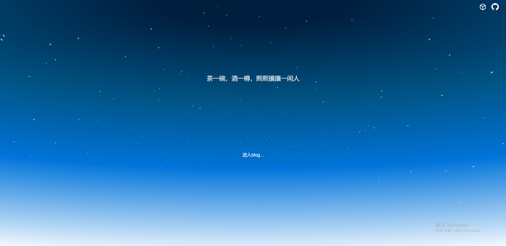
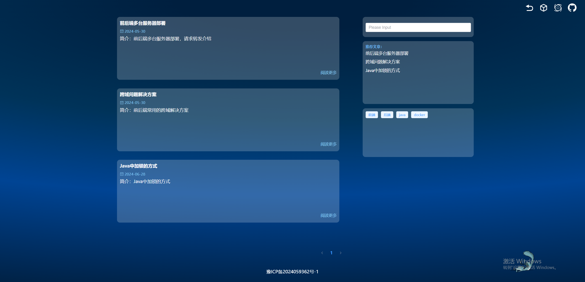
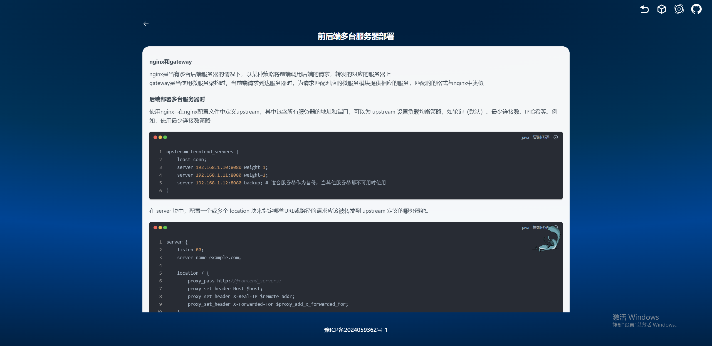
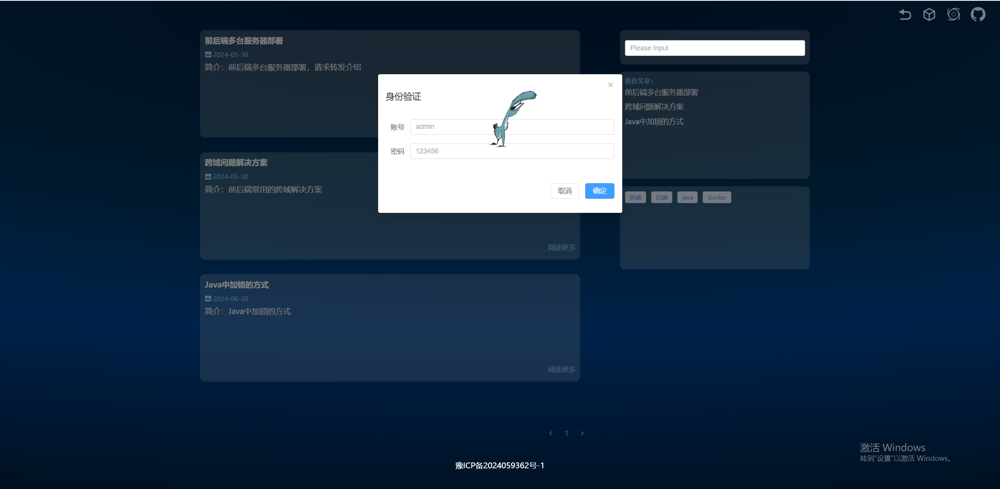
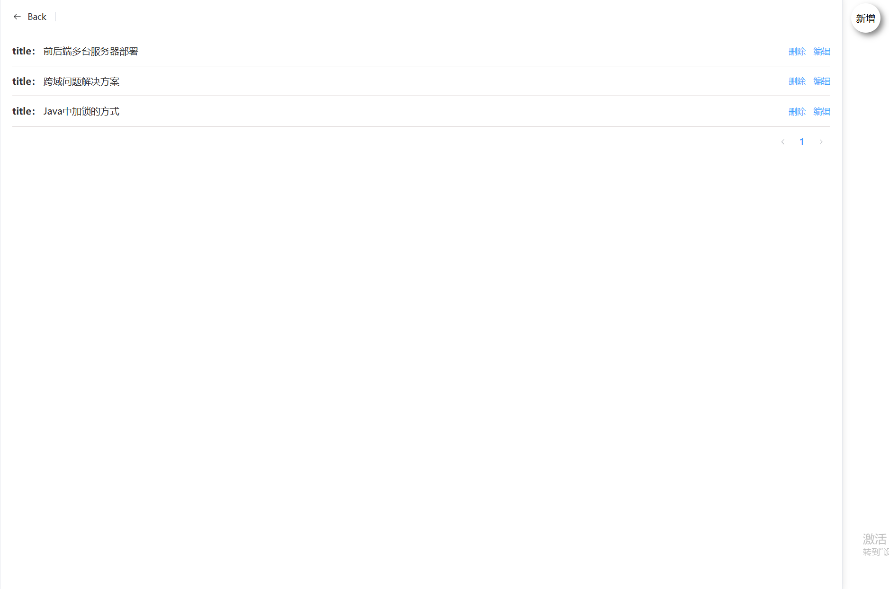
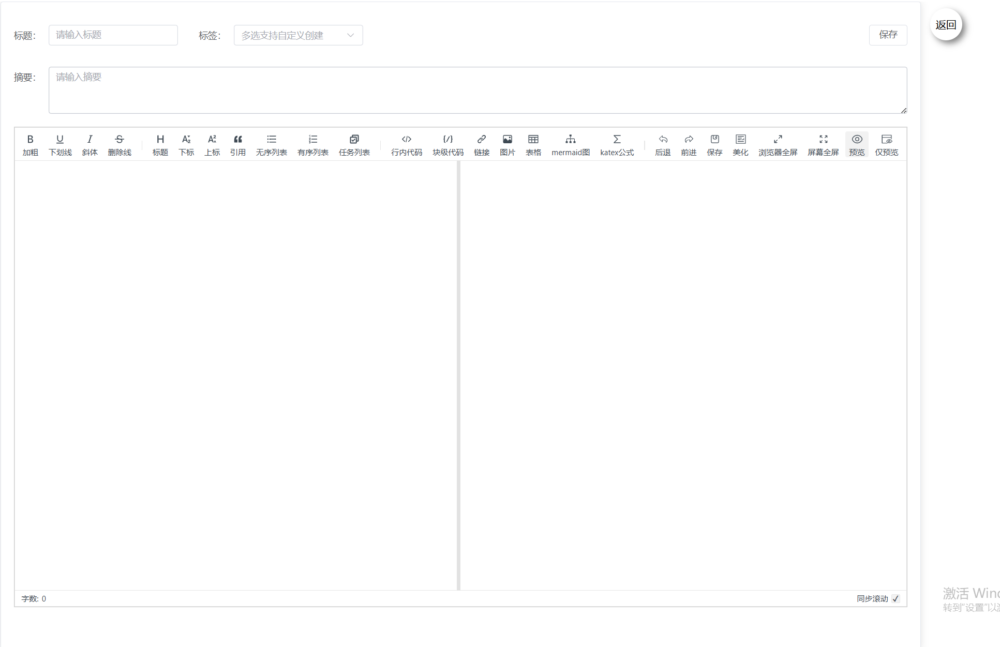

# demo-个人博客

做这个的初衷是想搭建一个个人的技术博客平台，部署在阿里云服务器上，通过域名进行访问。

后面发现服务器续费有点点贵，所以果断抛弃了（穷），但是配套前后端代码还是都在的。

首页：

做了点小小的设计，整个页面都是动态的效果

进入blog页面：

右上角分别是另外一个demo的地址，进入编辑blog页面，有一个小小的身份校验以及github仓库地址

文章具体内容可进行预览

进入编辑页面时会进行小小的身份验证，页面上的一个小动物是添加的一个gif，会在页面中不断地进行跳动变换位置

进入编辑页面后可以进行编辑，删除和新增的操作

新增就是一个比较经典的页面

最后贴一个github仓库地址-`[https://github.com/ddddkw/Beans_web](https://github.com/ddddkw/Beans_web)`
