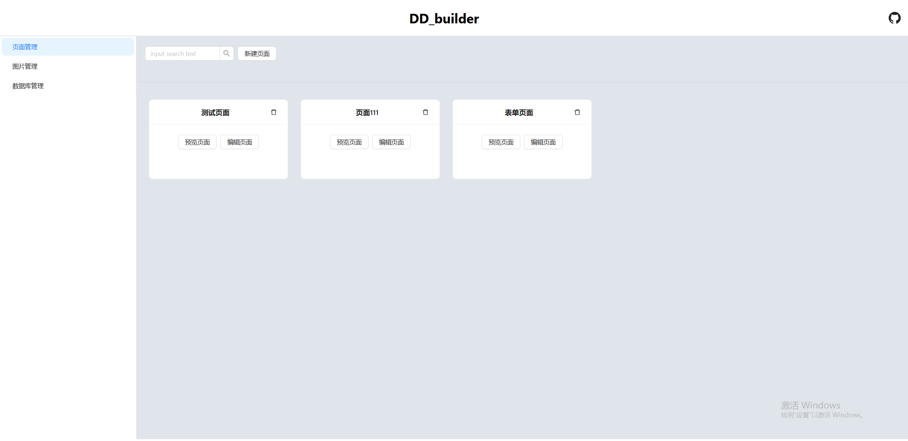
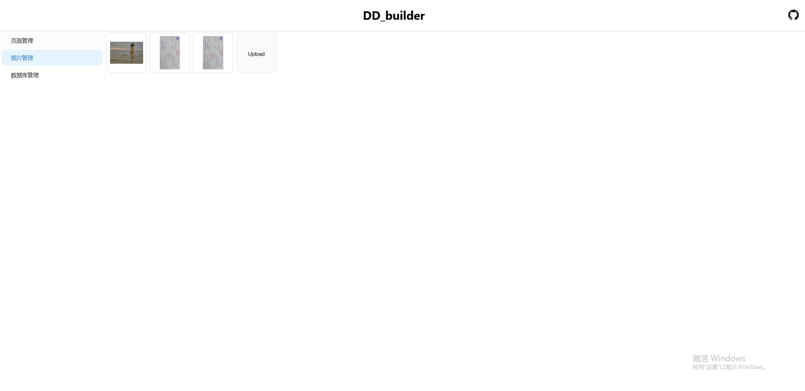
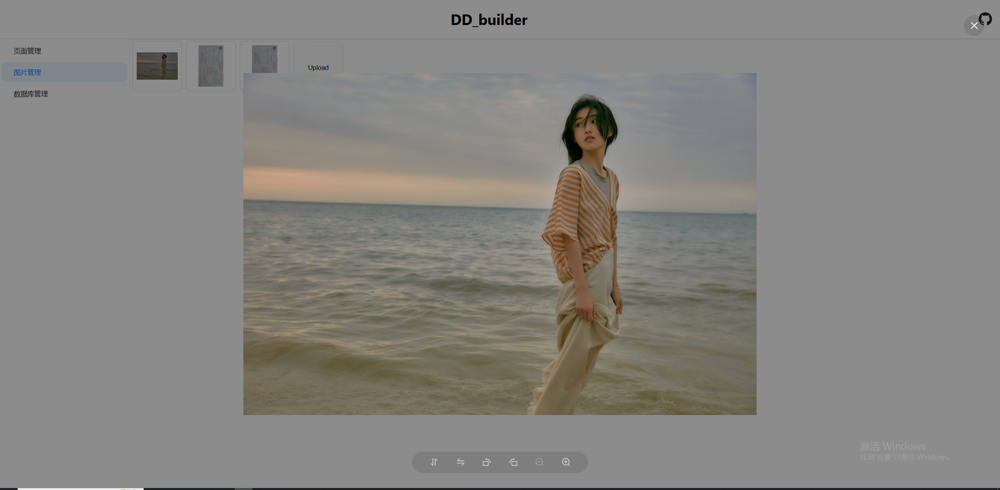
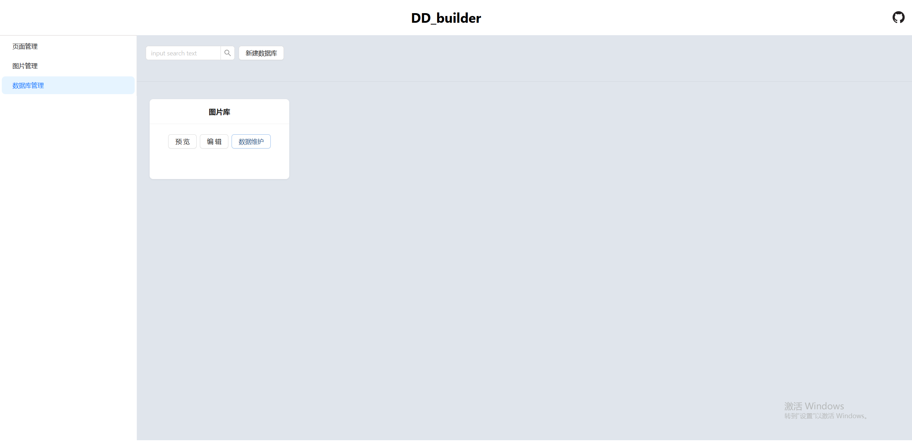
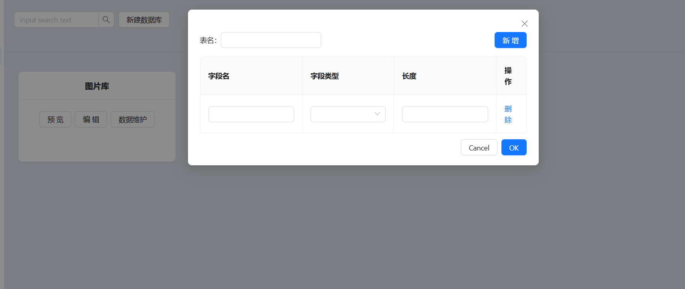
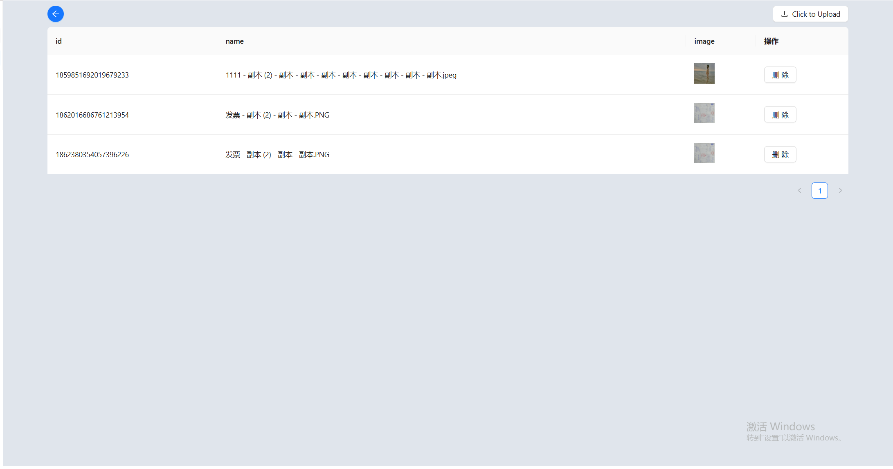

# 一个简易的页面构建工具

## 简介

做这个demo项目，是因为自己抽空学习了一下react，想着做一个小小的demo项目熟悉一下对react的掌握和使用

总体页面如下：

- 页面管理：在此模块下可进行页面的增删改查等
- 图片管理：此模块下主要是进行图片的管理预览等功能
- 数据库管理：此模块下主要是为了对数据库中的表以及表中的数据进行管理

## 页面管理

可通过新建页面进入，此页面下可进行组件的拖拽至中间画布以及右侧的组件的属性和样式调整

保存后，可对拖拽后保存的页面进行预览

## 图片管理

在图片管理部分，主要进行图片的增删改查和预览

除此之外还可进行预览

## 数据库管理

此模块下主要是为了对数据库中的表以及表中的数据进行管理

可进行表的新建，有点仿navicate的功能

也可对表中的数据进行增删

整个demo项目的前后端都是自己独自完成，后续会在开发-前端-低代码平台下进行完整的开发流程书写

**github地址：**https://github.com/ddddkw/tools_web

