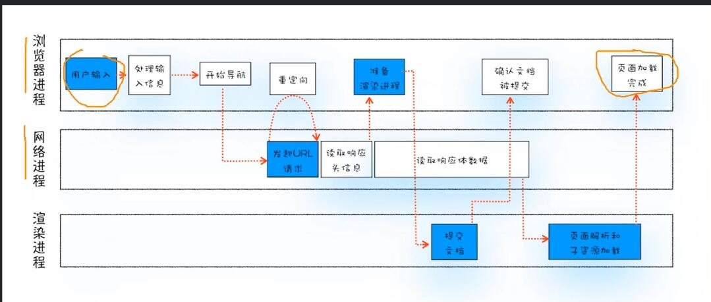
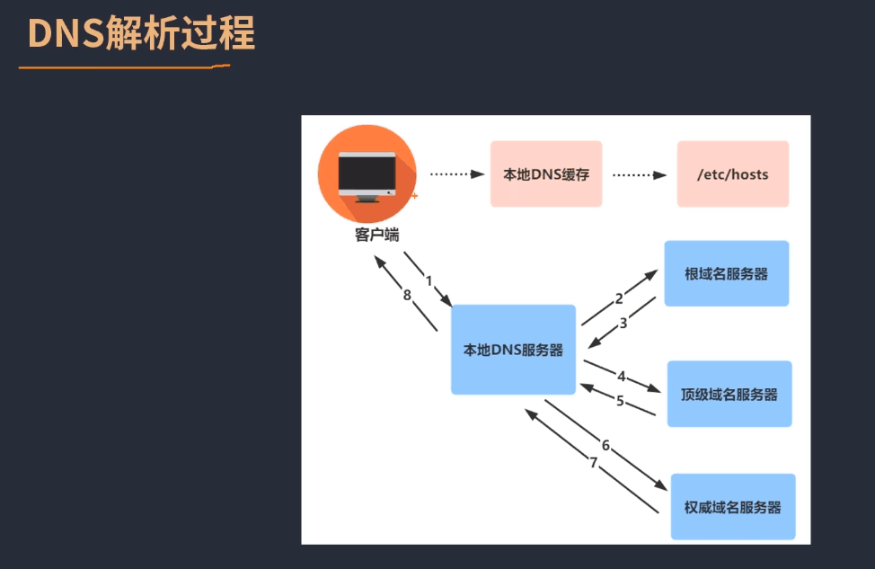
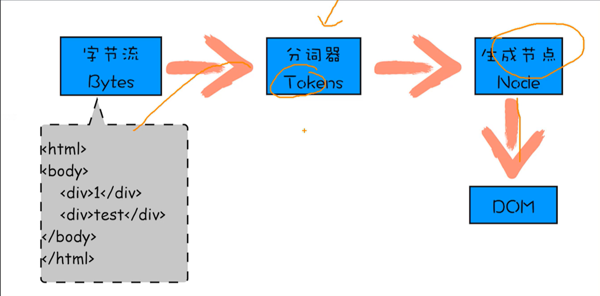
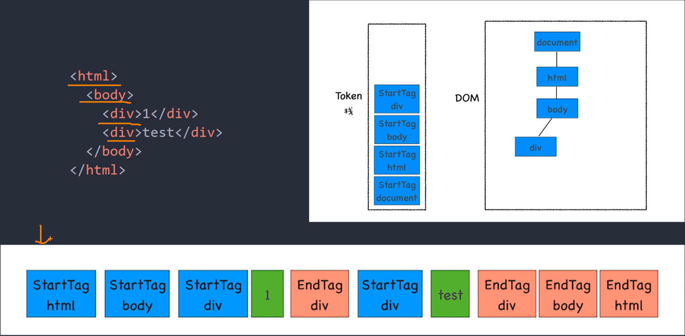
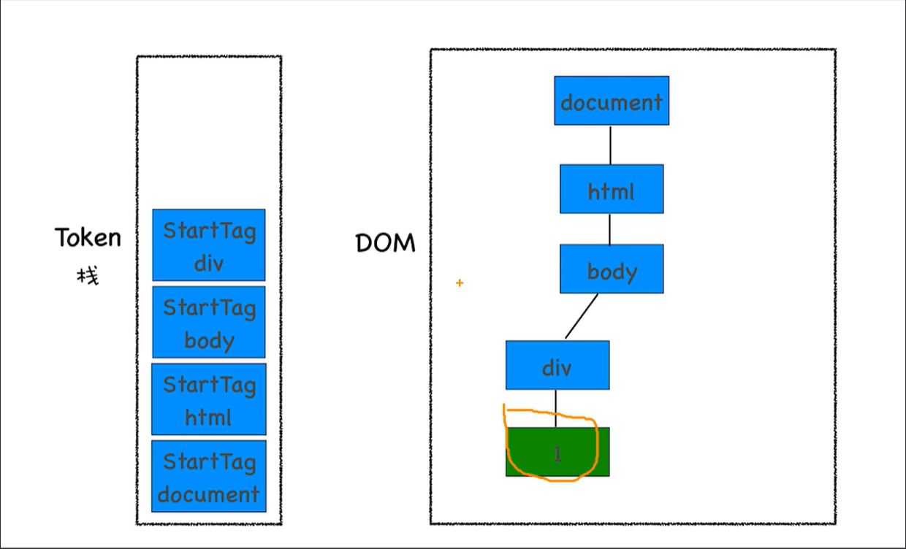
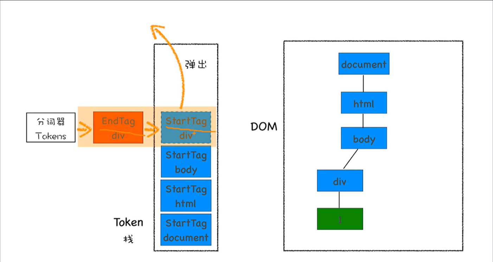
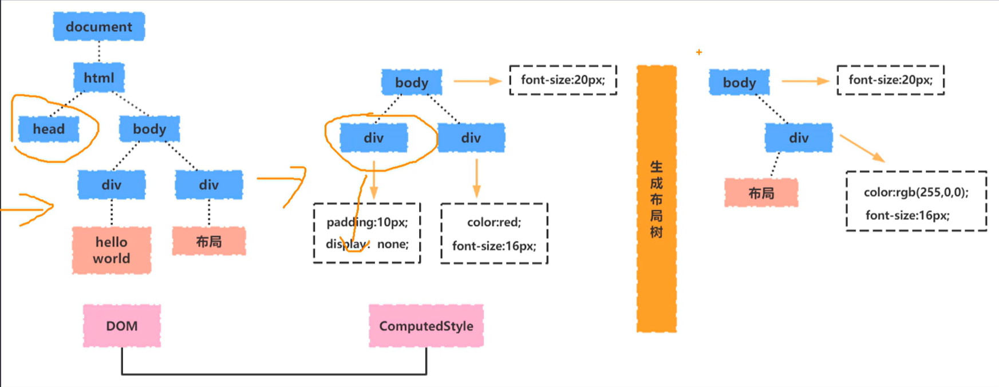

# 浏览器的工作过程

- 浏览器通过http或者https，向服务端请求页面
- 把请求回来的html代码经过解析，构建DOM树
- 计算DOM树上的css属性
- 根据css属性对元素逐个进行渲染，得到内存中的位图
- 一个可选地步骤是对位图进行合成，这会极大地增加后续绘制的速度
- 合成之后，再绘制到页面上

**telnet的使用**？用于创建连接


## 从输入url到展示页面的过程中发生了什么

整体流程

主要的三个进程是浏览器进程，网络进程和渲染进程



**输入url后发生了什么？**

输入一个url后，需要获取域名对应的IP，然后与IP对应的服务器建立连接，获取服务器上的一系列资源。从域名到IP的一系列步骤是通过DNS服务器实现的



**DNS服务器的作用**，通过域名获取到对应的IP地址，DNS是被设计为高并发高可用的，服务器之间是以一种树形的结构分布的

整体流程

- 对一个域名发起请求时，先请求本地的DNS缓存获取对应的IP
- 本地的DNS缓存没有的时候，会向本地DNS服务器发起请求
- 本地DNS服务器会向根域名服务器发起请求
- 根域名服务器返回顶级域名服务器访问地址
- 顶级域名服务器返回权威域名服务器访问地，最终在权威域名服务器中获取到域名对应的IP地址

### 浏览器进程

主要负责用户交互，子进程管理和文件存储等功能

### 网络进程

网络进程主要是面向渲染进程和浏览器进程等提供网络下载功能

### 渲染进程

渲染进程的主要职责是把从网络下载的HTML、JavaScript、css、图片等资源解析为可以显示和交互的页面

#### HTML字节流解析的过程

在获取到HTML字节流之后，会通过分词器将其生成一系列的tokens，然后生成对应的node节点，最终生成DOM



对于如下一段代码而言，其中的起始标签，标签中的文本以及结束标签都是一个token，并且会通过一个token栈来维护所有的token。正常来说token栈只会有StartTag

**在DOM树中如何判断结点的父子关系？**

根据栈中的标签的位置来计算，一般来讲，下面的标签一定是上面标签的父节点

```javascript
<html>
	<body>
    	<div>1</div>
		<div>test</div>
    </body>
</html>
```



文本信息会直接放入DOM树中对应的节点下



EndTag则是会在匹配到对应的StartTag后，连同StartTag一起出栈



#### 为什么要构建DOM树

因为浏览器不能理解HTML格式的字节流，需要将其转换为浏览器可以理解的结构

在渲染引擎内部，有一个叫HTML解析器的模块

它的职责就是负责将HTML字节流转换为DOM结构

DOM的作用：

- 从页面的视角来看，DOM是生成页面的基础数据结构
- 从JavaScript视角来看，DOM提供给JavaScript脚本操作的接口
- 从安全视角来看，DOM是一道安全防护线，把一些不安全的内容在DOM解析阶段就被拒之门外了

网络进程获取到对应的HTML字节流后，通过IPC将其传递给渲染进程，渲染进程将其传递给HTML解析器进行解析

#### 布局计算



#### 页面渲染

以页面的渲染效率来说：合成>重绘>重排，合成是V8中对页面特殊的处理

- **合成**：浏览器会将页面分为多个图层，最终再将图层合并在一起展示页面
- **重绘**：当元素的外观（颜色、背景颜色等）发生变化时，浏览器需要重新绘制这些元素的外观属性，只涉及外观更新，不涉及布局和几何属性
- **重拍**：当元素的几何属性发生变化时，浏览器需要重新计算元素的布局并重新渲染树，这个过程比重绘更加的复杂

**如何尽量减少不必要的重绘和重排**

- **批量修改样式**：将多次修改样式的操作合并成一次，减少DOM访问次数。使用css类来批量应用样式，而不是逐个修改样式属性
- **使用文档片段**：在内存中操作DOM节点，完成后再一次性添加到文档中，减少重排次数
- **避免频繁查询布局信息**：在修改样式前避免查询元素的布局信息，因为这会强制浏览器刷新渲染队列，触发重排
- **利用css动画**：使用css动画代替JavaScript动画，css动画在GPU上执行，性能更高
- **使用绝对定位**：将需要频繁重排的元素设置为绝对定位，使其脱离文档流，减少对其他元素的影响
