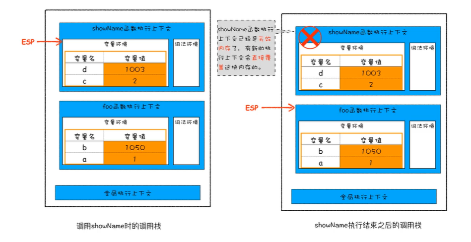
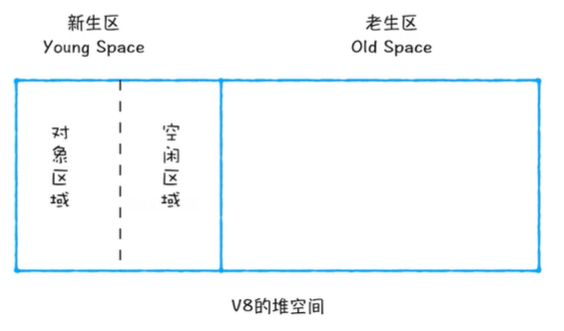

# 栈空间和堆空间，数据是如何存储的

js中的用于存储的空间

堆空间最大，栈空间最小


栈空间中保存的是引用地址，引用地址指向的是堆中具体的数据-只对于引用类型数据。基本的数据类型，数据本身还是存储在栈空间中的

作用域和执行上下文也都会被存储到栈空间


## 垃圾数据如何自动回收

手动回收

java，c++就是典型的手动回收内存的语言

自动回收

```javascript
function foo(){
    var a=1
    var b={name:'max'}
    function showName(){
        var c=2
        var d={name:'min'}
    }
    showName()
}
```

栈：

showName函数的执行上下文       ESP（指针，指向调用栈中正在执行的函数；ESP指针下移后就会将上面的执行上下文销毁）

foo函数的执行上下文

全局执行上下文

下图中的1003,1050是堆地址-调用栈中已经将执行上下文回收掉了，那么堆空间中是如何回收的？



### 代际假说

大多数对象是短命的

少数对象是长寿的

新创建的对象主要集中在‘新生代’中

‘老年代’对象较少被回收

V8根据对象的存活生命周期将其分为两个不同的区进行存储

新生区  1-8M   副垃圾回收器

老生区  100M+   主垃圾回收器

垃圾回收器的工作：

1. 标记：标记活动对象和非活动对象
2. 回收：回收非活动对象
3. 内存整理：内存碎片整理



#### 副垃圾回收器

副垃圾回收器主要进行新生区的垃圾回收

垃圾回收-新生区中每次进行的是复制操作，每次当对象区域空间满的时候，会现将活跃对象复制到空闲区域，对一些不活跃的进行清理，然后将整体复制到空闲区域，这样对象区域和空闲区域所行使的职能便互换了。

讲过两到三次垃圾回收后依旧存活的对象会被放到老生区，这样可以减少新生区在进行复制时所消耗的性能

#### 主垃圾回收器

标记+清除+内存整理（整理出来连续的内存）

- 标记：遍历扫描是否使用了这块内存区域
- 清除：清除被标记为垃圾数据的内存区域


