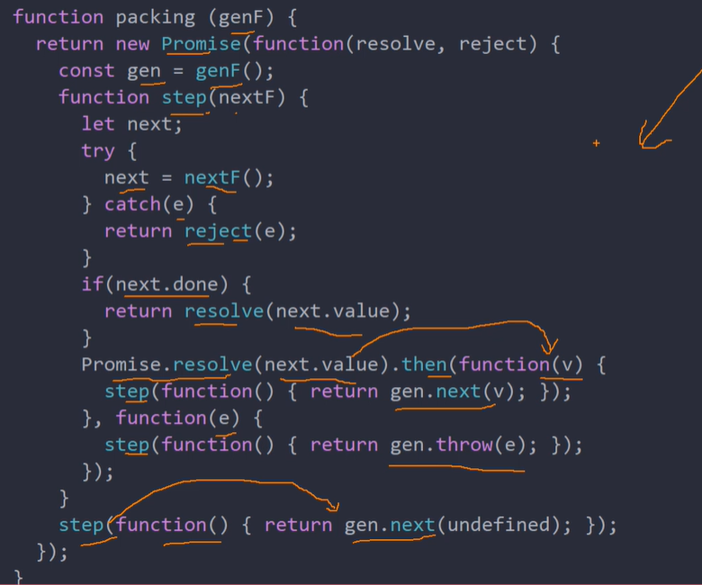

# async函数的实现原理

## 什么是async函数？

Generator函数的语法糖-语法糖就是用更加简练的语言表达较复杂的含义。在得到广泛接受的情况之下，可以提升交流的效率

async要与await配套进行使用

### 内置执行器

```javascript
const asyncReadFile = async function(){
    const f1 = await readFile('')
    const f2 = await readFile('')
}
asyncReadFile()
```

调用asyncReadFile函数，然后会自动执行，输出最后结果

async和await，比起星号和yield，语义更清楚。async表示函数里有异步操作，await表示紧跟在后面的表达式需要等待结果

### 返回值是promise

async函数的返回值是promise对象，这比Generator函数的返回值是Iterator对象方便多了。可以使用then方法指定下一步的操作。

进一步说，async函数完全可以看作是多个异步操作，包装成的一个promise对象，而await命令就是内部then命令的语法糖

async函数的await命令后面，可以是promise对象和原始类型的值（数值，字符串和布尔值，但这时会自动转成立即resolve的promise对象）

## async函数的基本用法

async函数本身返回的就是一个promise对象，所以除了在函数内部使用await语法糖之外，函数本身也是可以使用then的

```javascript
async function f(){
    return 1 // 基本类型的值，等同于 return await 1 
}
f().then(res=>{
    console.log(res) // 1
})
```

### 线程睡眠

```javascript
function sleep (interval,i) {
    console.log(i)
    return new Promise(resolve=>{
    return new Promise(resolve=>{
        setTimeout(resolve,interval)
    })
}
async function fiveAsync(){
        for(let i =1;i<5;i++) {
			sleep(1000,i) //同时打印1,2,3,4,5
            await sleep(1000,i) //每隔一秒打印1,2,3,4,5 await后的语句全部执行结束以后才可以继续往下执行
        }
}
```

让我想起了之前的一道面试题：一个数组，内有五个元素分别是五个方法，每个方法执行结束以后才可以去执行后面的方法（方法能否成功执行是随机的），且每一个方法有两次的重试机会，两次以后无论是成功或者是失败都会去执行下一个方法。当时没有做出来，现在想想就是要用async函数实现。

### 同时触发

当两个异步函数没有前后执行的必然关系时，可以使两个异步函数同时执行缩减执行的时间

```javascript
let foo = await getFoo()
let bar = await getBar()

// 写法一
let [foo,bar] = await Promise.all([getFoo(),getBar()])// 因为await本身就是会将后面的方法转为promise对象执行的，所以直接使用promise.all将其转为promise对象是一样的效果
// 写法二
let fooPromise = getFoo()
let barPromise = getBar()
let foo = await fooPromise;
let bar = await barPromise;
```

### await命令应用

前面提到的那个面试题就可以使用这个方法来处理，db是自己封装的处理函数，可以在db内部实现每一个方法有两次的重试机会进行执行的逻辑，但是不能够使用forEach，因为forEach中的回调是并发执行的，可以使用for循环

```javascript
async function dbFunc(db){
    let docs = [{},{},{}]
    docs.forEach(async function(doc){
        await db.post(doc)
    })
    for(let doc of docs) {
        await db.post(doc)
    }
}
```

### async函数实现原理

