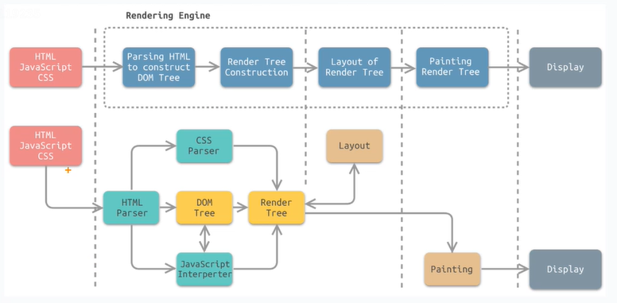
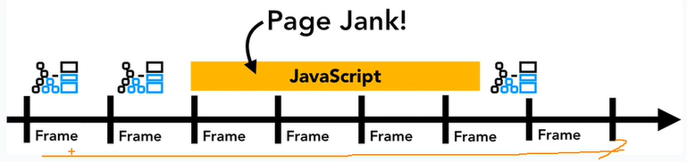
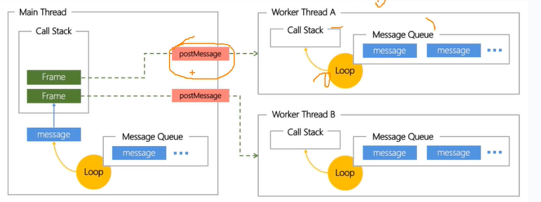
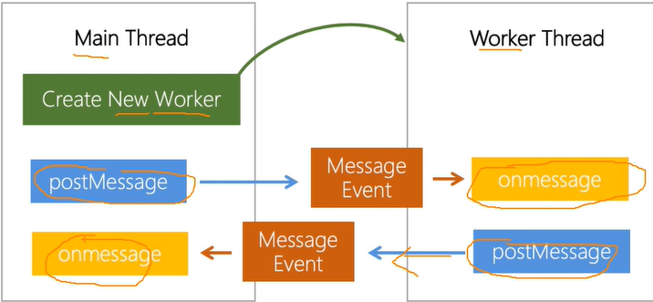
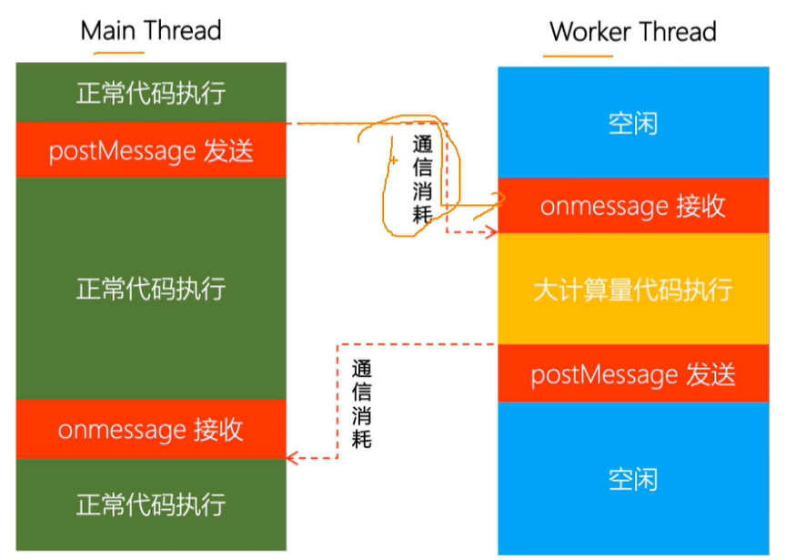

# web Work多线程机制

web work的作用，就是为JavaScript创建多线程环境，允许主线程创建worker线程，将一些任务分配给后者运行。在主线程运行的同时，worker线程在后台运行，两者互不干扰。

## 主线程和多线程

用户使用浏览器一般会打开多个页面（多tab），现代浏览器使用单独的进程渲染每个页面，以提升页面的性能和稳定性，并进行操作系统级别的内存隔离，这样当某个页面崩溃的时候不会影响到其它页面

### 主线程

页面内，内容渲染和用户交互主要是由render process（渲染进程）中的主线程进行管理，主线程渲染页面的每一帧，会有六个步骤，如下所示：

1. JavaScript
2. DOM树构建
3. style样式计算
4. layout图层构建
5. paint图层绘制
6. 合成显示



单线程的主要困扰是：主线程同步JS执行耗时过久时（浏览器理想帧间隔约16ms），会阻塞用户交互和页面渲染

主线程同步JS执行-代码按照顺序一条接一条地执行，每条语句必须等待前一条语句完成之后才能开始



如上图所示。长耗时任务执行时（比如某js代码的执行），页面将无法更新，也无法响应用户的输入/点击/滚动等操作。

### 多线程

web worker会创建操作系统级别的线程

JS多线程，是独立于主线程的JS运行环境，不同线程之间通过postMessage通信



多线程的情况下，就可以实现并发执行JS代码

### webWorker应用场景

- 可以减少主线程卡顿
- 可能会带来性能提升

worker在浏览器主线程渲染周期内，会将可能阻塞页面渲染的JavaScript运行任务迁移到worker线程中进行，进而减小主线程的负担，缩短渲染间隔，减少页面卡顿

### worker API

#### 通信API

在主线程js代码中创建worker线程，创建出来的worker线程运行环境是完全独立于主线程的



使用woker进行简易的通信

```javascript
// main.js
const worker = new Worker('./worker.js')
worker.postMessage('hello')
worker.onmessage = (event)=>{
    console.log(event.data)// world
}
// worker.js
self.onmessage = (event)=>{
    console.log(event.data) // hello
    postMessage('world') 
}
```

#### 通信开销

从线程发送信息到另外一个线程接收到信息之间有一定的时间消耗，这个消耗叫做通信消耗



worker运行环境与主线程的共同点：

- 包含完整的JS运行时，支持ES规范定义的语言语法和内置对象
- 支持XmlHttpRequest，能独立的发送网络请求和后台交互
- 包含只读的location指向worker线程执行的script url，可通过url传递参数给worker环境
- 包含只读的Navigator用户获取浏览器信息，如通过Navigator.userAgent识别浏览器
- 支持setTimeout/setInterval计时器，可用于实现异步逻辑
- 支持WebSocket进行网络I/O，支持IndexedDB进行文件I/O

其中的网络I/O和文件I/O能力可以给业务和技术方案带来很大的可提升空间

worker运行环境与主线程的差异点：

- worker没有DOM API，无法新建和操作DOM，也无法访问到主线程的DOM的element
- worker线程和主线程内存独立，worker线程无法访问页面上的全局变量（window，document等）和js函数
- worker线程不能调用UI相关的DOM API
- worker线程被主线程控制，主线程可以创建销毁worker线程
- worker线程可以通过self.close自行销毁

从差异点上看，worker线程无法染指UI，并受主线程控制，只适合默默的干活