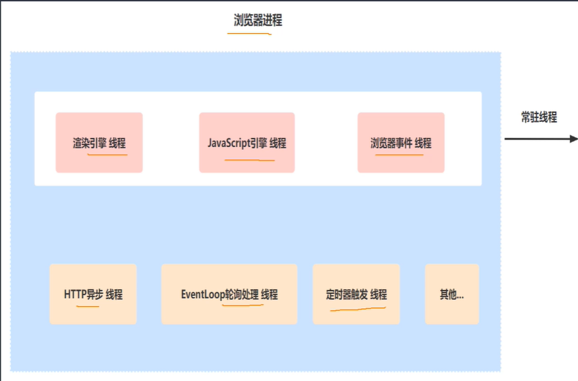
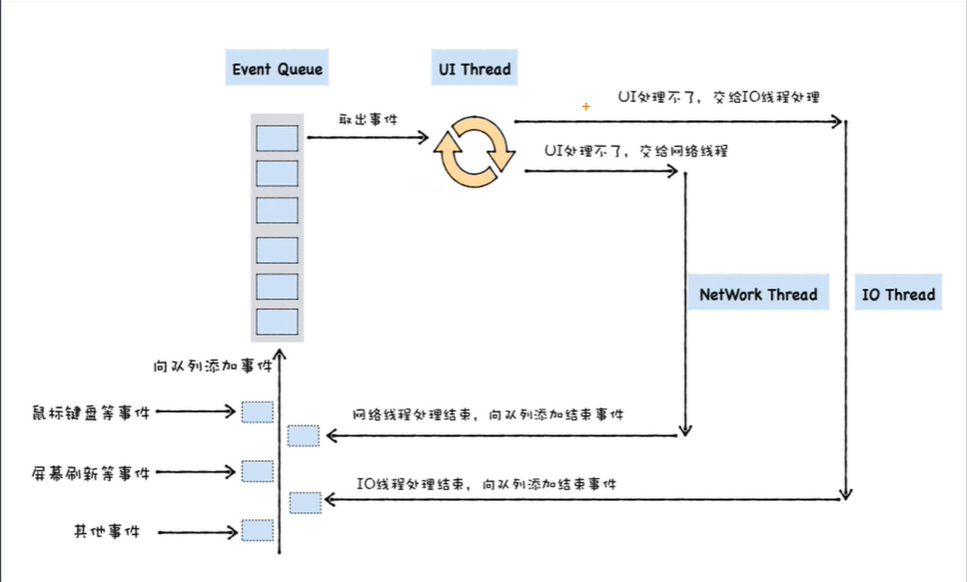
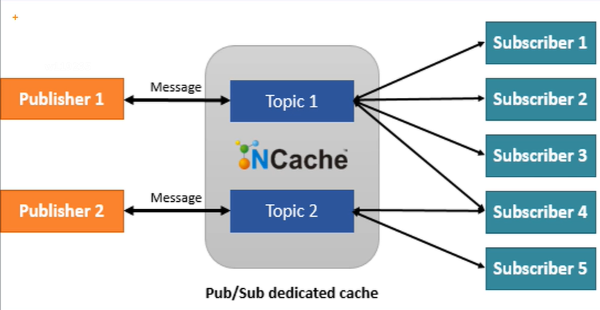

# 异步编程演变和发布订阅

## 浏览器的多线程

其中的JavaScript引擎线程就是我们前面说的主线程，主要作用就是解析和执行JavaScript代码



异步处理线程，JavaScript最原始的方式就是通过回调函数来执行异步任务，当某线程执行结束后将其回调函数塞入消息队列中等待继续执行



## 异步编程的解决方案

- 发布/订阅
- deferred对象
- Promise
- Generator
- async/await

后三者是JavaScript的异步任务的处理规范，最终目的是使用同步的写法实现异步代码

### 发布订阅

有后端基础的同学应该不难想到后端的消息队列，RocketMQ等



发布订阅简单实现：

```javascript
let eventMap={} //消息平台
function pub(msg,...rest){
    eventMap[msg] && eventMap[msg].forEach(cb=>{ // eventMap[msg]找到对应的主题下的所有订阅者
        cb(...rest) // 执行所有订阅者的回调函数
    })
}
function sub(msg,cb) { //消费者的构造函数，创建消费者对象的时候入参：消息主题和回调函数
    eventMap[msg] = eventMap[msg] || []
    eventMap[msg].push(cb)// 将对应的回调函数push进订阅者中
}
```

如何实现异步编程

1. A执行结束后，发布消息mesA
2. B订阅消息mesA，并执行对应的回调函数function。在回调函数中发布消息mesB
3. C订阅消息mesB，并执行的对应的回调函数...

发布订阅模式：发布者和订阅者之间是完全解耦的，

观察者模式：这个设计是松耦合的，被观察者需要维护一个观察者的集合，将有关状态的任何变更自动通知给观察者

### VUE中的数据侦测观察者

可以详细了解

