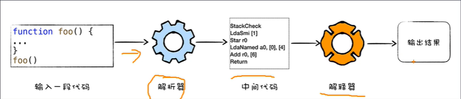
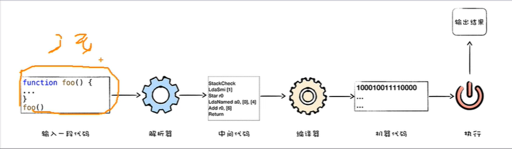
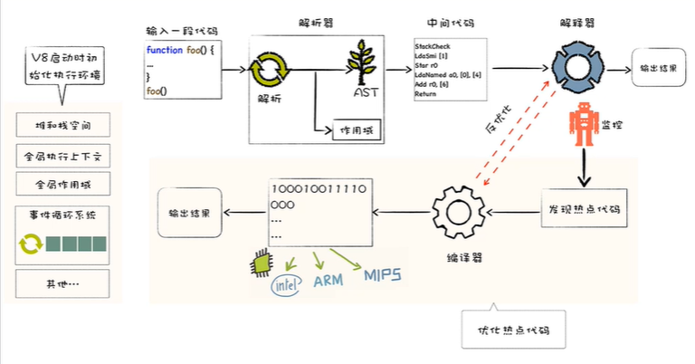

# V8是如何执行一段JavaScript代码的

## 什么是V8？

V8是谷歌用于编译处理JavaScript的引擎，因为正常的JavaScript代码浏览器是不识别的，需要使用V8引擎将其编译成浏览器可识别执行的代码。其实就是从高级语言到机器可识别的二进制指令的一个转化过程。

## 解释执行

首先将高级语言通过解析器转换为中间代码，通过解释器进行解释执行的最终的输出结果

边加载边解释执行-启动速度比较快，但是执行效率比较低

## 编译执行

首先将源代码通过解析器生成中间代码，编译器将中间代码编译生成一些可执行的二进制文件，执行这些二进制文件得到输出结果

先将源文件编译成二进制文件后，再执行-启动速度比较慢，但是执行效率高

上述步骤通常是通过虚拟机实现的，比如Java中的jvm，V8在这里就充当了一个JavaScript的虚拟机的一个角色

## 混合编译执行JIT

V8其实并不是单纯的解释执行或者单纯的编译执行，V8是两种混合起来使用的。

输入一段源码，解析器进行处理生成中间代码。解释器执行中间代码，生成结果。

在解释器执行中间代码过程中，会通过监控机器人发现执行过程中的热点代码（调用比较频繁的代码），通过编译器将热点代码编译成二进制可执行文件，后序在需要执行热点代码时，可直接执行二进制文件，不用解释器解释执行，提高了效率。

如果发现热点代码有修改，会通过反优化的步骤将代码重新解释编译生成新的二进制文件

## 减少反优化

1. 尽量保持对象的稳定性
2. 多次调用某个函数时，尽量保持参数类型一致