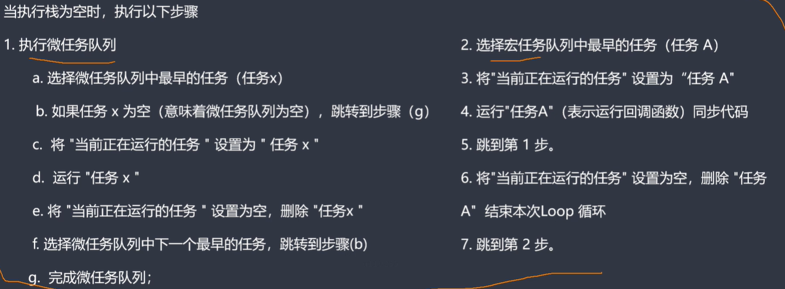

# js中的异步编程以及事件循环机制

## 同步函数和异步函数

- 同步函数：当一个函数是同步执行时，那么当该函数被调用时不会被立即返回，而是等函数所需执行的所有操作执行结束后再返回
- 异步函数：当一个异步函数被调用的时候，会立即返回，尽管函数规定的操作还没有全部执行结束

JavaScript本身是被设计为单线程机制的，但是做了一定的处理机制

## 处理机制

当一个线程调用一个同步函数时，如果该函数不能立即完成所需进行的操作，则该操作会导致线程的挂起，cpu会去执行其它的线程，直到该同步函数规定的操作完全执行结束后，最终该线程才会重新被调用

当一个线程调用的是一个异步函数时，该函数会立即返回尽管其规定的工作还没完成，这样线程就会执行异步函数后的语句而不会被挂起。那么异步函数中的工作是如何完成的，必然是有另外一个线程来完成的。

新的线程从哪里来？

要么是系统已经准备好的线程，要么是创建的新的线程

## 为什么JS要设计为单线程

因为js在最初设计时是为浏览器服务的。可以设想这么一个场景，假如说有两个线程，其中一个线程执行对DOM A修改的操作，另外一个线程在删除DOM A这种情况下就会出现问题

## JS是如何实现单线程非阻塞的呢

事件循环机制

同步任务就不详细介绍了，就是正常的按照顺序一步一步的进行执行

异步任务：比如一个ajax请求，当在执行同步任务的同时发起一个异步任务的时候，会将回异步放入一个新的队列-事件队列。执行栈中的任务会继续执行，当执行栈中执行完毕后，会去检查事件队列中的任务放入执行栈中执行，如果回调函数中也有异步任务，就重复上述步骤继续执行

### 微任务与宏任务

我们通常把宿主发起的任务叫做宏任务，JavaScript引擎发起的任务叫做微任务

宏任务：

- setInterval()
- setTimeout()

微任务：

- Promise().then(function(){})
- new MutationObserver()

对于异步任务来说，有一个宏任务队列，一个微任务队列

当主线程为空的时候会先去检查微任务队列，不为空的会先执行微任务队列中的任务。为空的话再去宏任务队列中找到排名第一的宏任务进行执行，如果该宏任务有对应的微任务，则将其微任务放入微任务队列中。等宏任务执行结束后去执行对应的微任务。

```javascript
setTimeout(function(){
    console.log(1)
}) // 宏任务
new Promise(function(resolve, reject){
    console.log(2) // 同步任务
    resolve(3)
}).then(function(val){
    console.log(val) // 微任务
})
// 输出2 3 1
// 执行一个宏任务后，会清空一次微任务队列

setTimeout(function(){
    console.log(1)
}) // 宏任务
new Promise(function(resolve, reject){
    console.log(2) // 同步任务
    resolve(3)
}).then(function(val){
    console.log(val) // 微任务
    setTimeout(function(){ // 放到下一次事件循环中执行，即使是放到宏任务队列中也是放在其它宏任务后
   	 console.log(4)
	})
})
// 输出2 3 1 4
```

### 为什么要设计微任务？

因为宏任务的执行时机是不可控的，当同步任务执行完成以后，会先去执行微任务队列中的任务，如果将某些比较重要的任务放在宏任务队列中，则可能会因为微任务队列中一直有任务而导致宏任务无法执行。相对而言，微任务的执行时机是可控的

例如，vue中的异步更新队列，会先去尝试使用微任务，只有当执行环境不支持微任务时，才会去使用宏任务

注意，宏任务中也是有同步任务和异步任务之分的



