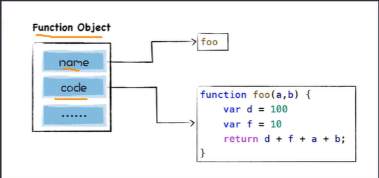
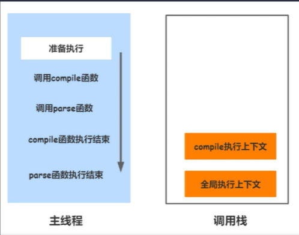
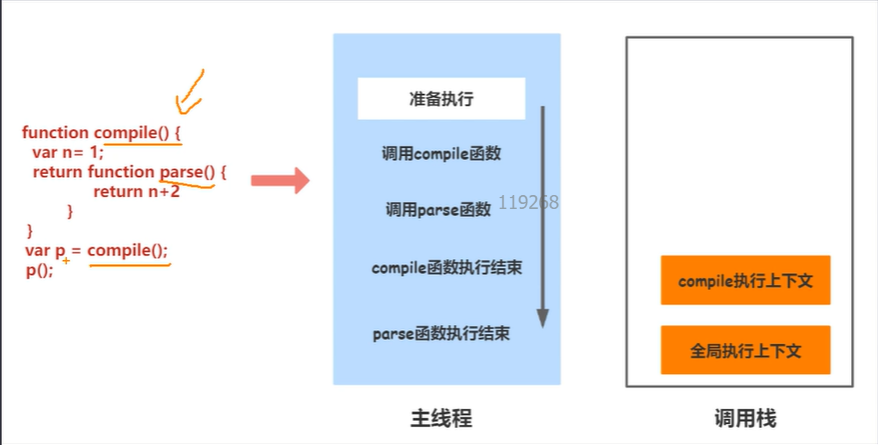

# V8是如何实现闭包的

## JavaScript闭包

闭包指的是一个函数，且这个函数绑定了词法环境。通俗点讲就是可以在一个内层函数中访问到外层作用域

## 惰性加载

V8不会一次性的将所有的JavaScript代码解析为中间代码，主要基于以下两点

- 如果要将所有的代码一次性解析编译完成，这会严重影响到首次执行JavaScript代码的速度，会大大增加用户的等待时间
- 其次，解析完成的字节码和编译之后的机器代码都会存放在内存中，如果一次性解析和编译所有JavaScript代码，那么这些中间代码和机器代码就会一直占用内存

## 惰性解析

```javascript
function foo(a,b){
    var d = 100
    var f = 10
    return d+f+a+b;
}
```

对如上一个函数进行存储的时候会像下面的图片一样，遇到一个函数时会将其转换为一个函数对象，并不会处理局具体的函数内容

只有在调用函数的时候才会执行操作将函数体中的code转换为AST对象，然后再转换为中间代码



## JavaScript中闭包基础特性

JavaScript闭包相关的三个重要特性：

- 可以在JavaScript函数内部定义新的函数
- 内部函数可以访问父函数中定义的变量
- 函数是一等公民，所以函数可以作为另外一个函数的返回值

在JavaScript中函数也是一个对象

**执行上下文**

执行上下文是用来跟踪记录代码运行时环境的抽象概念。每一次代码运行都至少会生成一个执行上下文

执行上下文有如下两种类型：

- 全局执行上下文：当运行代码是处于全局作用域内，则会生成全局执行上下文，这也是程序最基础的执行上下文
- 函数执行上下文：当调用函数时，都会为函数调用创建一个新的执行上下文

**调用栈**

有了执行上下文就要有一个合理管理它的工具--调用栈。调用栈是一种数据结构，用于管理在主线程上执行的函数的调用关系，是一个LIFO（先进后出）的栈



**执行流程图**

在一个函数执行结束后，其上下文是会被销毁的，在compile函数执行结束后，parse函数还没执行结束，但是parse函数用到了compile函数中的变量n，所以compile函数执行结束后再调用parse函数会出现问题

V8中如何处理：

引用了**预解析器**：

- 判断当前函数是不是存在一些语法上的错误
- 检查函数内部是否引用了外部变量

当检查到函数内部使用了外部变量的时候，会将域中的变量复制到内存中，这样就避免了因为闭包导致的问题


