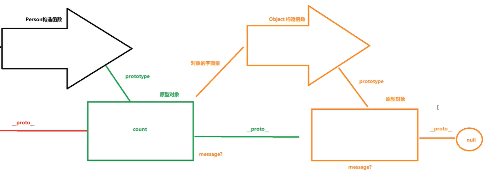
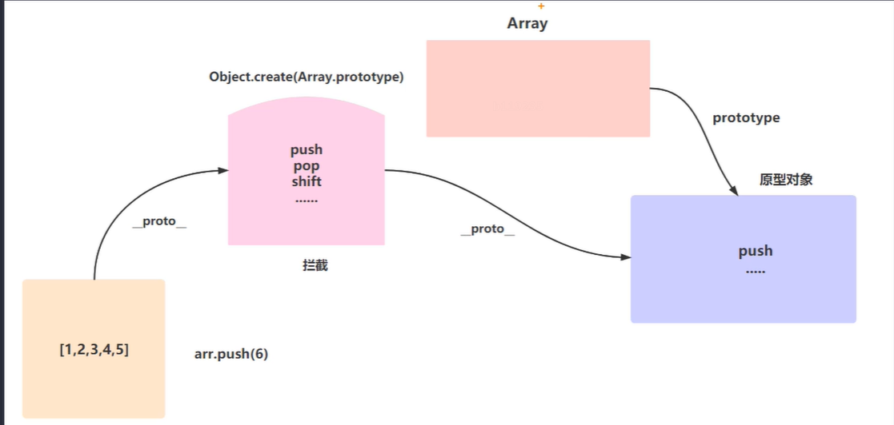

# V8如何实现对象继承

## 基于类的设计

先有类，再从类去实例化一个对象，类与类之间又可能会形成继承，组合等关系

## 基于原型的设计

基于原型的继承通过复制的方式来创建新对象有两种思路（就是我们常说的深拷贝和浅拷贝）：

- 一个是并不真的去复制一个原型对象，而是使得新对象持有一个原型对象的引用
- 另一个是切实的复制对象，从此两个对象再无关联

js中使用的就是第一种方法，这边牵扯出里原型链的说法，即所有对象都有一个_proto_指向其原型对象，可以调用其原型对象上的方法。（小想法：直接在原型对象上设置属性或者方法，岂不是全局公用方法？）

## 对象，构造对象，原型对象与原型链

对象会指向构造函数的原型对象

```JavaScript
function Person(){ //构造函数
    
}
// 原型对象，可直接修改prototype的指向
Person.prototype ={
    
}
var max = new Person();// 1,创建一个实例，2：此对象的_proto_执行prototype

console.log(max._proto === Person.prototype) //true

```

原型对象首先是一个对象，其次才是一个原型对象，当它本身没有某种属性的时候，会去找它的原型对象

Object构造函数是js中的内置的一个构造函数，Object构造函数的原型对象的_proto_指向是null



直接更改对象的_proto_的指向

```javascript
var c ={
   
}
var b = {
    message:"hello,i am b"
}
c._proto_ = b
console.log(c.message)// 输出hello,i am b
```

## 原型代理

Array是一个构造函数，Array的原型对象中的push，pop，shift等是js中处理数组的方法

在实例对象与Array的原型对象之间嫁接一层对象（代理原型对象），把能够改变数组的方法都扩展一份，虽然无法操作Array构造函数的原型对象中的方法，但是却可以对代理原型对象中的方法进行扩展，自己定义对应方法中的逻辑。

比如，在arr.push(6)方法的时候会先看arr本身有无push方法。没有的话会沿着_proto_找到代理原型对象，在代理原型对象中拦截对应的方法并且对原有的操作保持不变，在此基础上我们便可以做一些比如响应式的操作，数据变化后将对应的视图更新。

这也解释了为什么vue2中在使用definePrototype实现响应式时，无法监听到根据数组下标修改数据，但是却可以监听使用Array原生方法操作数据



示例（对vue源码的简化）：

```javascript
var methods=[
    "push",
    "pop",
    "shift",
    "unshift",
    "splice",
    "sort"
]

var arrMethods = Object.create(Array.prototype);
methods.forEach(method=>{
    arrMethos[method] = function(){
        // this指向的是调用该方法的对象，如下面调用时就是array
        // arguments 是一个类数组对象，包含了传递给函数的所有参数。它不是真正的数组，但它有索引属性和一个length属性，允许你像遍历数组一样遍历它
        // apply方法接受两个参数：第一个是要作为调用方法时的this值的对象，第二个是一个数组或类数组对象，其元素将作为单独的参数传递给调用的方法。
        Arrar.prototype[method].apply(this, arguments) // 原方法继续执行
        // 数据发生变化后通知所有的监听者，进行对应的变化
        console.log("我已经拦截到了你对"+method+"方法的操作")
       
    }
})

var array = [1,2,3,4]
array._proto_=arrMethods;
array.push(5) // 我已经拦截到了你对push方法的操作
console.log(arr);//[1,2,3,4,5]
```

