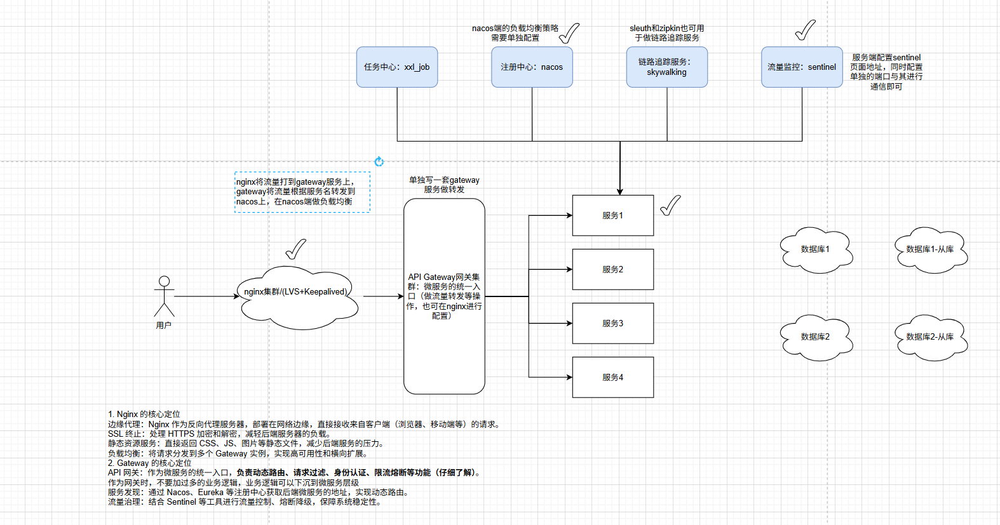

# 微服务全家桶

## **一、核心组件：一站式微服务治理**

先贴一张微服务中比较普遍的一个架构图



### 1、nacos（服务注册与配置中心）

- **功能**：替代 Eureka + Config Server，实现服务注册与发现、动态配置管理。
- **优势**：支持 AP/CP 两种模式（默认 AP 高可用优先），配置可动态刷新，无需重启服务。

nacos的配置安装比较简单，这里就不一一赘述了

示例配置：

```
server:
  port: 9010
spring:
  application:
    name: dd-service
    nacos:
      username: ${nacos_username:nacos}
      password: ${nacos_passwd:nacos}
      discovery:
        server-addr: ${nacos_addr:127.0.0.1:8848}
```

### 2、**Sentinel（流量防卫兵）**

- **功能**：限流、熔断、降级，防止系统过载。
- **优势**：可视化控制台实时监控，支持热点参数限流（如针对某个商品ID限流）。

