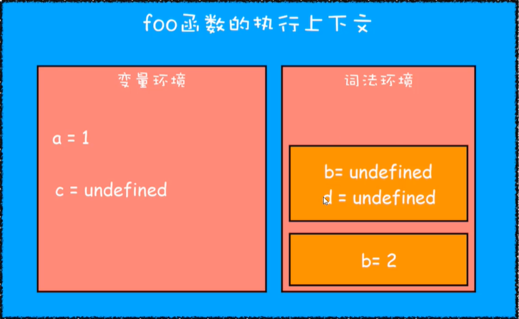
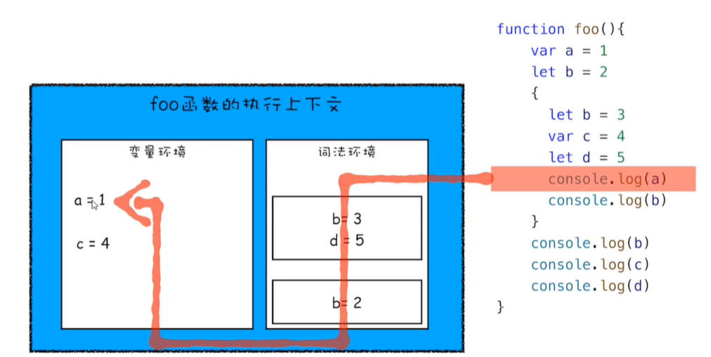

# var的缺陷以及为什么要引入let和cponst

作用域：作用域是指在程序中定义变量的区域，该位置决定了变量的生命周期

通过var声明的变量都会被提升到函数或者全局作用域的顶部，但是仅仅提升声明

**变量提升带来的问题**

变量容易在不被察觉的情况下被覆盖，本应销毁的变量并没有被销毁

**es6是如何解决变量提升带来的缺陷**

引入了块级作用域、let和var

## JavaScript如何支持块级作用域

思考如何既支持变量提升，又支持块级作用域--与执行上下文有关

```javascript
function foo(){
    var a=1
    let b=2
    {
        let b=3
        var c=4
        let d=5
        console.log(a)
        console.log(b)
    }
    console.log(b)
    console.log(c)
    console.log(d)
}
```

通过var关键字声明的变量存放在变量环境中，通过let关键字声明的变量存放在词法环境中，且依照代码块来进行区分的

当执行到一个作用域时，作用域的信息会被压入栈中，执行结束后，其信息会从栈中移除

如：

上述代码中的 console.log(a)会先从词法环境的栈顶向下寻找，词法环境中没有时，会去变量环境中寻找



具体的查找顺序如下：



## 作用域链和闭包

```javascript
function bar(){
    console.log(myname) // 1
}
function foo(){
    var myname = 2
    bar()
}
var myname = 1
```

为什么上述代码的输出结果是1？

因为foo函数和bar函数的上级作用域都是全局上下文，为什么都是全局上下文是因为：

**JavaScript执行过程中，其作用域链是由词法环境决定的**

### 词法作用域

词法作用域就是指作用域是由代码中函数声明的位置来决定的，所以词法作用域是静态的作用域，通过它就能预测代码在执行过程中的如何查找标识符

上级的作用域是由词法环境决定的，而不是由声明决定的，具体效果如下

```javascript
function bar(){
    console.log(test) // 1
}
function foo(){
    let test = 2
    {
        let test = 3
    	bar()
    }
}
let test = 1
foo()
```

### 闭包

在JavaScript中，内部函数总是可以访问外部函数定义的变量，即使外部函数已经执行结束，由于内部函数引用了外部函数的变量，所以外部函数中的变量还不可以被销毁，依旧要存放在内存中