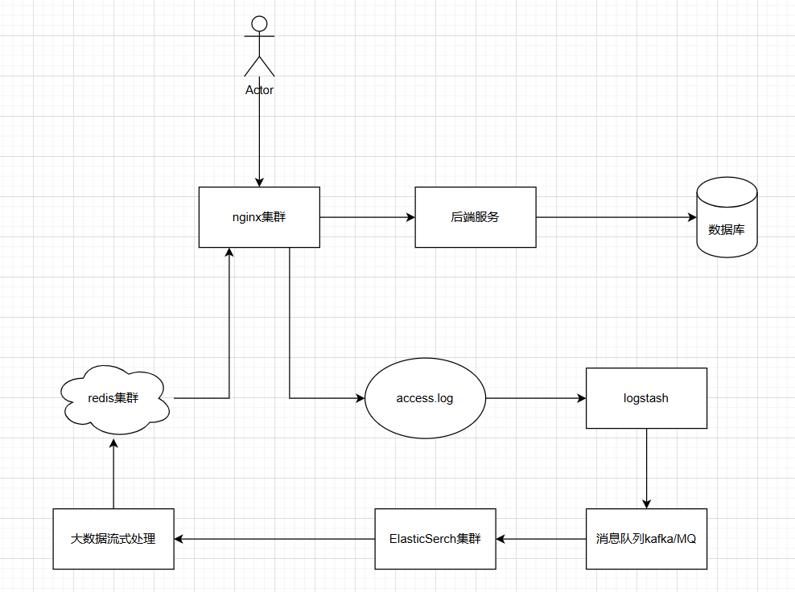

# OpenResty

OpenResty 的目标是让你的Web服务直接跑在 [Nginx](https://openresty.org/cn/nginx.html) 服务内部，充分利用 [Nginx](https://openresty.org/cn/nginx.html) 的非阻塞 I/O 模型，不仅仅对 HTTP 客户端请求,甚至于对远程后端诸如 MySQL、PostgreSQL、Memcached 以及 Redis 等都进行一致的高性能响应。

> OpenResty官网链接-https://openresty.org/cn/download.html

OpenResty搭配lua脚本使用

## nginx中的事件驱动架构

传统的Web服务器通常依赖于为每个请求分配独立的线程或进程，这样一来，当并发请求量增大时，系统的资源消耗和上下文切换会迅速增加，导致性能瓶颈。而Nginx的事件驱动架构，通过一个单一的进程来处理所有的请求，避免了线程的过度切换和内存的浪费，实现了高效的I/O处理。

事件驱动架构（Event-driven Architecture，EDA）是一种通过事件来驱动系统行为的架构模式，广泛应用于高并发、高性能的应用场景。与传统的线程模型不同，事件驱动架构通过监听、捕获和响应事件来实现系统操作。在Nginx中，事件驱动架构使其能够高效地处理大量并发连接，避免了传统多线程模型中大量线程的创建与销毁所带来的性能开销。

### 事件驱动架构与传统的多线程模型的区别

在传统的多线程或多线程模型中，每个请求通常会启动一个新的线程或进程来处理。这种模型虽然直观，但是处理大量并发请求时会有问题：

- 资源消耗，每个请求都需要一个独立的线程或进程，导致大量的内存和CPU开销
- 上下文切换：大量的线程或进程会频繁的进行上下文切换，影响系统的响应速度和吞吐量

事件驱动架构通过事件循环机制将所有的请求集中处理在少量的线程中（甚至只有一个线程）。当事件发生时，事件驱动系统会根据事件类型触发相应的回调函数或处理逻辑。由于事件处理是非阻塞的，它不会因等待I/O操作而阻塞整个系统。

### Nginx中的事件驱动架构

Nginx中的事件驱动架构是nginx高性能的关键，Nginx通过一个**事件循环**机制来管理所有的I/O操作。其基本流程是：

- 当一个请求到达时，Nginx会通过系统调用（如 `epoll`、`select`、`kqueue` 等）等待事件的发生
- 一旦检测到有请求事件或I/O事件，Nginx就会将其交给相应的事件处理器进行处理
- 所有的事件都通过非阻塞I/O模型来进行，这意味着Nginx可以在不阻塞的情况下高效地处理大量并发连接

Nginx的**master进程**负责启动和管理工作进程（worker），而每个工作进程则通过事件驱动机制处理客户端请求。与传统的多线程Web服务器不同，Nginx的工作进程通常会复用一个事件循环，不会为每个请求分配一个线程。

## OpenResty中的扩展库

OpenResty有一些扩展库是已经内置好的


在使用时，通过修改nginx配置文件修改

```js
#设置纯lua扩展库的搜寻路径
lua_package_path "$perfix/lualib/?.lua;;";

#设置c编写的lua扩展模块的搜寻路径（也可以用';;'）
lua_package_cpath "$perfix/lualib/?.so;;"
```

配置黑名单：

```js
location / {
            access_by_lua_file lua/black_ip_list.lua;
        }
```

在conf同级目录下创建lua文件夹，在其内部创建black_ip_list.lua文件，配置黑名单规则

```js
local black_ips = {["127.0.0.1"]=true}

local ip = ngx.var.remote_addr
if true == black_ips[ip] then
    ngx.exit(ngx.HTTP_FORBIDDEN)
    return;
end
```

自动化黑名单封禁思路



## nginx+OpenResty实现资源下载限速

nginx中有一个$limit_rate，这个反映的是当前请求每秒能相应的字节数，该字节数默认为配置文件中的limit_rate指令的设值

```js
location /download {
            access_by_lua_block {
                ngx.var.limit_rate = '30k'
            }        
            alias /beansboot; // beansboot文件夹
        } 
// 下载命令
wget "127.0.1:8080/download/beansboot.jar"

```

网盘中资源下载限速的原理

下载限速实现原理：

- 常用的是漏桶原理和令牌桶原理
- 漏桶算法
- 令牌桶算法
