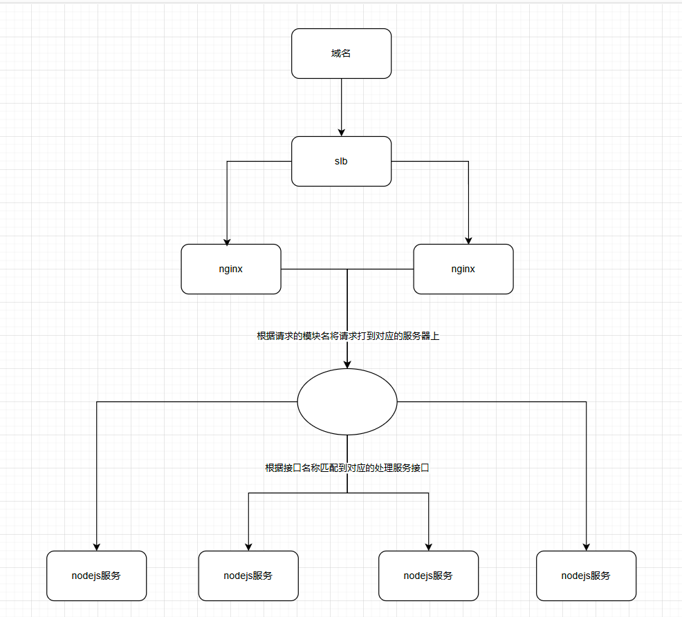

# nodejs的简介

nodejs可以理解为是js的一个运行环境，类似于java的jvm。

nodejs中的路由设计：

思路-在nodejs服务端通过获取到请求的url，根据url匹配到对应的文件，通过fs模块将对应的文件内容读取到，通过接口返回给请求端

```js
var http = require("http")
var fs = require("fs")
var server = http.createServer(function (req,res) { // 创建服务器
    if (req.url==="***") { // 根据请求的url匹配对应的文件
        fs.readFile("*****",function (err,data) {
            res.end(data)
        }) 
    } else {
        res.end("无页面显示")
    }
})
server.listen(3000) // 在3000端口启动服务
```

nodejs中的路由设计又叫做顶层路由设计，通过路由进行页面的读取

老一代的路由实际上都是通过映射服务器的物理文件夹实现的，nodejs中路由与服务器中的物理文件夹没有任何联系


