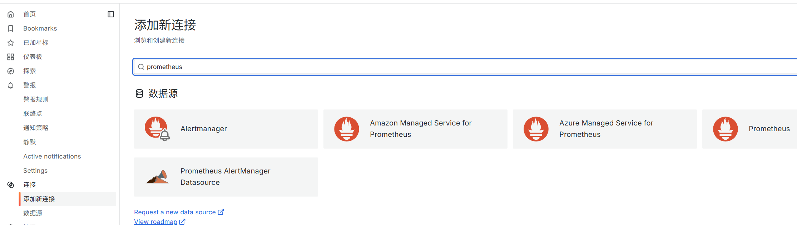
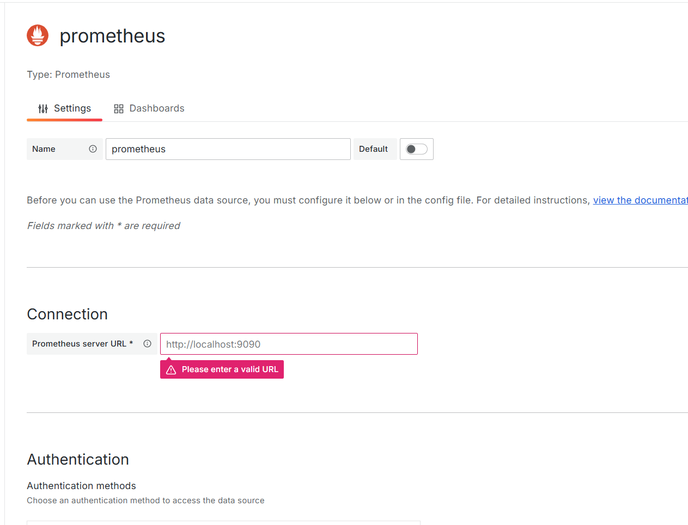

# grafana

Grafana 是一款开源的 **数据可视化与监控平台**，通过动态仪表盘将时间序列数据（如指标、日志、事件）转化为直观的图表，帮助用户实时监控系统状态、分析性能瓶颈并快速定位故障。

首先需要下载压缩包`wget https://dl.grafana.com/enterprise/release/grafana-enterprise-11.4.0.linux-amd64.tar.gz`

然后将其解压 `tar -zxvf grafana-enterprise-11.4.0.linux-amd64.tar.gz`

进入解压后的文件夹下，进入bin目录下，使用命令./grafana-server web启动grafana

然后通过ip:3000访问grafana

grafana可以自己配置数据源，比如需要结合Prometheus，我们就需要配置Prometheus的数据源

