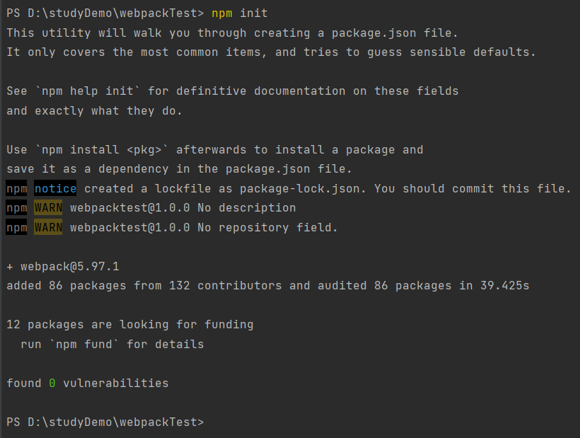

# webpack打包原理流程解析

## 创建一个简单的webpack的Demo

首先创建一个文件夹-webpackTest

使用npm init命令，对文件夹进行初始化



安装webpack

`npm i webpack`

创建webpack.config.js文件，定义入口文件和出口文件

```javascript
const path = require('path')
module.exports = {
    mode: "production",
    entry: {
        main:'./src/main.js'
    },
    output: {
        path: path.resolve(__dirname,'dist'),
        filename: "chunk.js"
    }
}
```

在package.json中添加webpack打包命令即可通过命令进行打包

```
"scripts": {
  "test": "echo \"Error: no test specified\" && exit 1",
  "build": "webpack"
},
```

## AST-抽象的语法树（对象）

将代码解析成一个对象

1. 解析入口文件 获取AST（配置）手写解析器 babel/parser
2. 找到所有的依赖模块
3. 将AST语法树转为浏览器可以执行的代码
4. 递归解析所有的依赖项 生成依赖关系图
5. 重写require函数 输出bundle

作用：

- 依赖分析
- 代码转化
- 优化和分析

### 解析入口文件，创建一个AST对象

通过使用babel/parser，将JavaScript代码转换为AST

```javascript
const  fs = require('fs');
const parser = require('@babel/parser')
const options = require('./webpack.config')
const path = require("path");

const Parser = {
    // 这里的path是指需要将入口文件的路径传过来
    getAst: path=>{
        // 读取入口文件,将其转换为utf-8
        const context = fs.readFileSync(path,'utf-8')
        return parser.parse(context,{
            sourceType:'module'
        })
    }
}

class Compiler {
    constructor(options) {
        const { entry , output } = options
        // 入口文件
        this.entry = entry
        // 出口文件
        this.output = output
    }
    run(){
        // 获取到转换后的AST对象
        const ast = Parser.getAst(this.entry)
        console.log(ast)
    }
    generate(){}
}
// 创建一个Compiler实例
new Compiler(options).run();

```

### 找到所有的依赖模块

使用babel中的@babel/traverse工具获取入口文件的所有依赖

- 遍历AST的结点，
- 访问和修改结点，通过traverse提供的各种访问可以访问每个结点的属性等，并且对其进行修改
- 条件跳过和终止遍历的操作
- 插件开发（针对特定的结点）

```javascript
const dependence = Parser.getDependence(ast,this.entry)
// 在parser中构建获取入口文件依赖的方法
// 获取入口文件的依赖的方法
getDependence: (ast,fileName)=>{
    // 注册处理函数对ast进行处理
    const dependence ={}
    // node是调用traverse中的方法时的自带的参数。第二个参数是traverse的配置对象
    // ImportDeclaration和CallExpression都是traverse内置的方法
    // import 语句结点
    traverse(ast,{
        ImportDeclaration({node}) {
            // 获取到整个依赖树的根节点-根据传进来的入口文件
            const dirname = path.dirname(fileName)
            // 生成依赖模块的路径
            const filePath = './'+path.join(dirname,node.source.value)
            dependence[node.source.value] = filePath
        },
        // 当遇到函数调用表达式的情况的时候
        // 获取到node结点的信息
        CallExpression({node}){
            // 如果函数调用名是require的话
            if (node.callee.name ==='require') {
                const moduleName = node.arguments[0].value
                // 将模块名添加到依赖列表中
                dependence[moduleName] = moduleName
            }
        }
    })
    return dependence
}
```

### 将AST语法树转为浏览器可以执行的代码

@babel/core和@babel/preset-env工具包

- @babel/core：转换代码，将源代码转换为目标代码，babel的核心库，包含所有核心功能和API
- @babel/preset-env：设置转换的规则

@babel/core--将源代码解析成抽象语法树（AST），根据配置的插件和预设对AST进行转换，将转换后的AST重新生成JavaScript代码

1. 转换代码
2. 编译代码
3. 配置选项
4. api的接口

@babel/preset-env--是一个预设，本质上是一个插件集合，使用时需要@babel/core提供的框架来工作，将多个插件的配置封装成一个易于使用的包，简化了babel的配置过程

1. 根据目标环境自动确认转换规则
2. 按需加载转换的插件--只会加载必要的转换插件
3. 智能处理浏览器的兼容性

在Parser中定义getCode的方法将ast转换为浏览器可识别的code

```javascript
const { transformFromAst } = require('@babel/core')
// 进行代码转换的方法--将ast转换为浏览器能执行的code
getCode:(ast)=>{
    const {code} = transformFromAst(ast,null,{
        presets:['@babel/preset-env'] // 通过预设的模块来进行转换
    })
    return code
}
```

### 生成依赖关系图

首先，捋一下大致的思路，构建一个build方法，单独用于处理构建生成依赖关系图。在调用Compiler类的run方法的时候，调用build方法，从入口文件开始一级一级的往下进行处理，第一级以下的通过对dependence中的文件名获取对应的ast，dependence，code等信息

```javascript
// 进行构建的build方法
build(filename){
    const {getAst,getDependence,getCode} = Parser
    const ast = getAst(filename)
    const dependence = getDependence(ast,filename)
    // 将入口文件内容转换为可执行的代码，从输出结果来看，就是文件中的代码本身
    const code = getCode(ast)
    return {
        // 文件名称
        filename,
        // 文件路径 每个模块的唯一标识符
        ast,
        // 依赖对象，保存着依赖模块路径
        dependence,
        // 文件内容
        code
    }
}
```

在run方法中调用build方法

```javascript
run(){
    // 在第一次调用run方法的时候，对入口文件调用一次build获取到入口文件的依赖项
    const info = this.build(this.entry)
    this.modules.push(info)
    // 获取到每个成员的依赖信息
    this.modules.forEach(({dependence})=>{
        // 如果依赖存在的话，对每个依赖项执行build方法
        if (dependence) {
            for (let item in dependence) {
                // 这种写法在forEach执行结束之前会不断地往this.modules数组中push数据，保证对所有的依赖文件都能进行处理
                this.modules.push(this.build(dependence[item]));
            }
        }
    })
    // 生成依赖关系图 Array.reduce 入参分别是Array[0],Array[1]--可以详细了解下数组的reduce方法
    const dependencyGraph = this.modules.reduce((graph,item)=>({
        ...graph,
        // 使用文件路径作为每个模块的标识，保存对应模块的依赖对象和文件内容
        [item.filename]:{
            dependence:item.dependence,
            code:item.code
        }
    }),{})
    console.log(dependencyGraph)
}
```

### 重写require函数，输出bundle

还是先捋一下思路，这里只是实现一个简单的打包功能，所有文件中的具体内容是依据模板来创建的。主要思路就是根据输出的文件webpack.config.js中的文件中定义的output.path以及filename等属性，通过fs模块将内容输出到具体文件夹下的文件中

```JavaScript
// 输出bundle
generate(graph){
    console.log(graph)
    // 输出的文件路径
    const filepath = path.join(this.output.path,this.output.filename)
    // template
    const bundle = `
        // 创建一个dist文件夹，文件内容
        (function (graph){
            // 重写require函数
            function require(moduleId){
                function localRequire(relativePath){ // 依赖模块的路径
                    return require(graph[moduleId].dependence[relativePath])
                }
                console.log(moduleId);
                const exports = {};
                (function (require,exports,code){
                })(localRequire,exports,graph[moduleId].code)
                // 暴露exports对象
                return exports
            }
            // 从入口文件开始执行
            require("${this.entry}")
        })(JSON.stringify(graph))`
    const distFolder = path.dirname(filepath) // 去除文件名 返回目录 检测dist目录是否存在
    if (!fs.existsSync(distFolder)) {
        fs.mkdirSync(distFolder,{recursive:true})
    }
    // 创建一个文件夹，文件内容就是bundle
    fs.writeFileSync(filepath,bundle,"utf-8")
}
```


