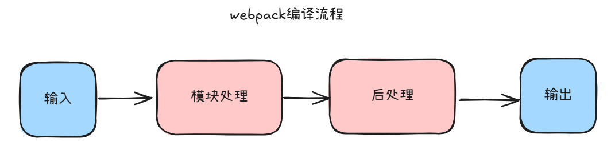
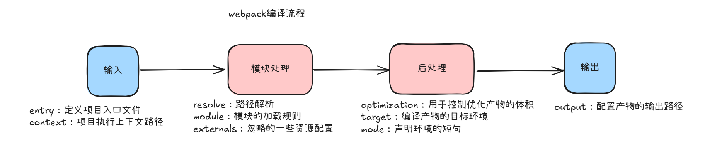
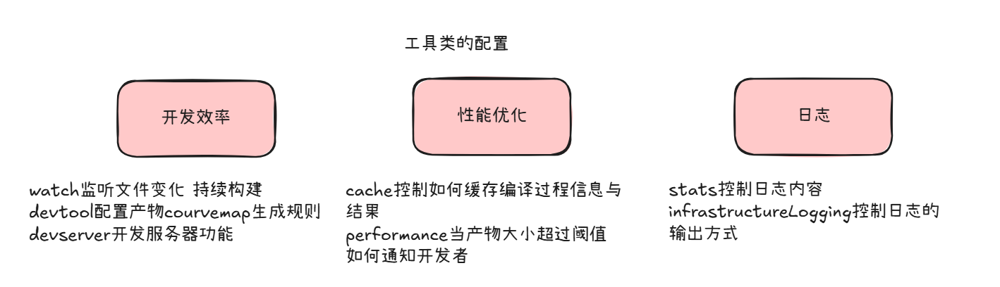

# webpack实践

**资源构建模型**

这种设计有很多优点：

- 所有的资源都是module，所以可以用同一套代码实现诸多特性。包括：代码压缩，hot module，hmr，缓存等
- 打包时，资源和资源之间非常容易实现信息互换、例如可以情意在HTML中插入base64格式的图片
- 借助loader，webpack几乎可以用任意方式处理任意类型的资源，例如可以用less、sass的等预编译代码

极强的开放性 ts babel less sass postcss jest karma

**webpack的编译流程**



- **输入：**从文件系统读入代码文件
- **模块处理：**调用loader转义module内容，并将结果转换为AST，从中分析出模块依赖关系
- **后处理：**所有模块地柜处理完毕后开始执行后处理，包括模块合并，注入运行时，产物优化等，最终输出chunk集合
- **输出：**将chunk写出到外部文件系统

**各流程的一些主要的配置模块以及其实现的功能**



**从工具类配置的角度可以分为三个方面进行说明：开发效率、性能优化以及日志**



一个基础的webpack.config.js文件内容

```javascript
const path = require('path')
const HtmlWebpackPlugin = require("html-webpack-plugin");
module.exports = {
    entry: './src/index.js',
    output: {
        path: path.resolve(__dirname,'dist'),
        filename: "bundle.js",
        clean: true
    },
    mode:"development",
    devServer:{ // 代码运行时的配置文件，配置本地开发服务器的一些选项
        static:{ // 指定静态文件根目录，这里是 dist 文件夹。
            directory:path.join(__dirname,"dist")
        },
        compress:true,
        port:9000, // 指定运行端口
        hot:true, // 开启热模块替换（HMR），允许在不刷新页面的情况下更新代码
        open:true, // 自动打开浏览器窗口
    },
    plugins: [
        new HtmlWebpackPlugin({
            template: "./src/index.html" //指定模板文件
        })
    ],
    module: {
        rules: [
            {
                test: /\.js$/, // 匹配所有js结尾的文件
                exclude: /node_modules/, // 排除node_modules目录下的文件
                use: {
                    loader: "babel-loader" // 使用babel-loader来转译这些文件，使得最新的JavaScript特性也可以在老版本浏览器中运行
                }
            }
        ]
    }
}

```

### loader和plugin的区别

在webpack中，loader和plugin是两个不同的概念，用于处理不同的任务。他们在功能和使用方式上都有明显的区别。loader主要用于文件转化，而plugin则用于执行更广泛的构建任务

- loader：用于转换模块的源代码
- plugin：用于执行范围更广的任务，它们不仅仅是文件转换，还可以参与到整个构建流程中，执行各种复杂的操作，如代码压缩、打包优化、资源管理、生成html文件等

**区别**

处理范围

使用方式

功能

### webpack处理css资源的基本流程

解析文件

当webpack在模块依赖图中遇到css文件时，它会使用配置好的loader来处理这些文件。通常，css-loader会负责解析css文件，将其转换为JavaScript中可以使用的模块

将css插入到页面中

在开发模式下，通常使用style-loader将css内联到JavaScript中，并通过style标签动态插入到HTML的head部分

在生产模式下，通常使用min-css-extract-plugin将csst提取到独立的.css文件中，并在html中通过link标签引用这些文件

优化处理

如果工程需要还可以通过插件和其他loader进一步处理css文件，如添加浏览器前缀、压缩css等

**css预处理器**：sass  less

### webpack中接入postcss

postcss是一个用于处理CSS的工具

首先，需要安装相关依赖项

```javascript
 npm i postcss-loader postcss autoprefixer
```

autoprefixer：自动添加浏览器前缀


