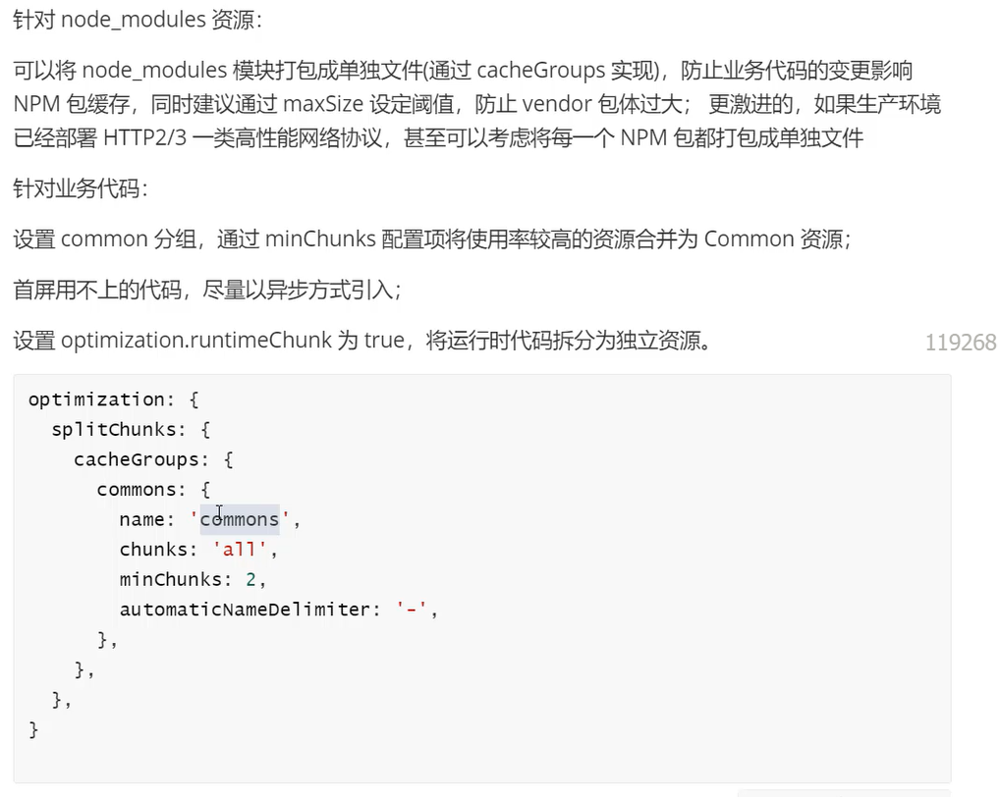

# 性能优化实践

如果不想做任何其他配置的话，就使用最新版本的webpack

**webpack5版本的性能优化：**

lazyCompilation 按需编译：

比如通过import引入模块的时候，未被使用的模块不会被编译，只有使用的模块才会被编译--vite也是这样的

**约束loader的执行范围：**

使用module.rules.include、module.rules.exclude来限制或者排除loader的执行文件范围

```js
{
    test: /\.js$/, // 匹配所有js结尾的文件
    exclude: /node_modules/, // 排除node_modules目录下的文件
    use: {
       loader: "babel-loader" // 使用babel-loader来转译这些文件，使得最新的JavaScript特性也可以在老版本浏览器中运行
    }
},
    
{
    test: /\.js$/, // 匹配所有js结尾的文件
    exclude: {
        and: [/node_modules/],// 排除node_modules目录下的文件
        not: [/node_modules\/lodash/], // 但是不排除node_modules目录下lodash中的文件
    }
    use: {
       loader: "babel-loader" // 使用babel-loader来转译这些文件，使得最新的JavaScript特性也可以在老版本浏览器中运行
    }
},
```

**使用noParse跳过文件编译：**

```js
module: {
     noParse: /lodash|react/,
}
```

由于跳过了前置的AST分析动作，构建过程无法发现文件中可能存在的语法错误，需要到运行（或Terser做压缩）时才能发现问题，所以必须确保noParser的文件内容的正确性；

跳过了依赖分析，所以文件中，建议不要包含import/export/require/define等模块导入导出语句--换句话说，noParser文件不能存在对其他文件的依赖，除非运行环境支持模块化方案；

跳过了内容分析，webpack无法标记该文件的到处值，也就无法实现tree-shaking

**开发模式下禁用产物优化：**

```js
 optimization: { // 开发环境下的一些配置
        removeAvailableModules: false, // 开发环境不移除有用的模块
        removeEmptyChunks: false, // 是否移除空的代码块
        splitChunks: false, // 是否将代码分割成多个代码块
        minimize: false, // 输出的代码是否要压缩
        concatenateModules: false, // 是否将多个模块合并在一起
        usedExports: false, // 是否标记未使用的导出，以便在后续移除
    },
```

**最小化watch监控范围：**

当有一些确定不会发生变化的代码时，可以将其排除在watch监控范围之外

```js
 watchOptions: {
        ignored: /node_modules/
    },
```

**跳过TS类型检查：**

在配置中跳过TS的类型检查，而将TS的编译检查功能托管给编译器，带写代码的时候就进行类型检查，而不是在编译过程中执行

还可以通过使用*fork-ts-checker-webpack-plugin*插件将类型检查能力剥离到子线程执行

**优化ESLint性能：**

使用eslint-webpack-plugin替换eslint-loader

`npm i eslint-webpack-plugin` 后在plugins中注册即可

借助编辑器的Eslint插件实现代码检查

使用husky，仅在代码提交前进行代码检查

**慎用source-map：**

source-map是将压缩后的代码还原成结构更好，更易理解的代码。但是显而易见的这个工作会对性能方面造成很大的影响

**设置resolve缩小搜索范围：**

```js
  resolve: {
        enforceExtension: false, // 是否强制性要写文件后缀名
        extensions: [".ts",".js"]
    }
```

**webpack code splitting**

代码拆分：如webpack中将chunk文件进行拆分，将应用的代码拆分为多个小块，每次加载时只加载需要展示的模块，避免每次都将所有代码加载完成后再展示

- 减少初始加载的时间
- 按需加载
- 减少内存的占用
- 适应不同的设备和网络环境

webpack默认情况下会将尽可能多的模块代码打包在一起，减少最终页面的http请求数，但这种方式的缺点是：页面初始代码包过大，影响首屏加载性能

SplitChunksPlugin插件 根据产物包的体积，引用次数等做分包优化

- webpack根据entry创建chunk对象，遍历构建阶段找到所有module对象，同一entry下的模块分配到entry中的chunk

- 遇到异步模块则创建新的chunk对象，并将异步模块放到该chunk中

- 分配完毕后，使用SplitChunksPlugin插件对chunk进行裁剪，拆分，合并，代码调优


**根据module使用频率分包**

每个分包后的代码包都需要通过http请求去获取，所以如果分割过多的话也会导致性能问题

```js
 optimization: { // 开发环境下的一些配置
        splitChunks:{ // 是否将代码分割成多个代码块
            // 对所有的代码都进行代码分割操作
            chunks: "all",
            // 设置引用次数超过2的模块才进行分包
            minChunks: 2,
            // 设置分包的数量
             maxInitialRequests: 2, // 用于设置initial chunk最大并行请求数，如果请求的主包+子包的数超过了这个阈值，那么就会自动放弃体积较小的子包  initial是对entry配置的入口模块生效
            maxAsyncRequests: 2, // 用于设置Async chunk最大并行请求数 Async是对异步引入的模块生效，就是用过import引入的资源
            minSize: true, // 超过这个尺寸的包才会被分包
            maxSize: true, // 超过这个尺寸的包会尝试进一步拆分出更小的包
        },
 }
```

**缓存组cacheGroups**

cacheGroups适用于设置缓存组规则，为不同类型的资源设置更有针对性的分包策略

```js
optimization: { // 开发环境下的一些配置
        splitChunks:{ // 是否将代码分割成多个代码块
            cacheGroups: { // 可详细学习下其下的配置
                vendors:{
                    test: /[\\/]node_mudoles[\\/]/, // 所有符合test判断的module或chunk都会被分到该组
                    minChunks: 1,
                    minSize: 0
                }
            }
        },
}
```

通用的最佳分包策略：




