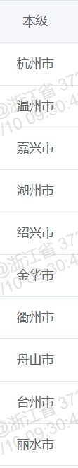

# 记一次大数据量查询时的优化

在实际开发中遇到这么一个场景：需要统计某个组织及其下级组织的所有项目总数以及当前组织发起的支付申请的金额总数。

具体效果如下（以浙江省为例）：



这样的话会有一个问题是：当查询是省一级的时候，查询速度会比较慢，影响用户体验

## 之前的逻辑

会根据前端传的组织编码OrgCode，将当前组织以及下面的所有的组织的项目查询出来。在省级的话，就是会将省内所有地区的所有的项目全部查询出来。查询时间会比较慢，所以对这里做一下优化

```java
List<String> projectTypeIds = ProjectTypeEnum.getByProjectType(projectType);
        Wrapper<PerformLibraryDO> queryWrapper = Wrappers.lambdaQuery(PerformLibraryDO.class)
                .select(PerformLibraryDO::getId, PerformLibraryDO::getCurOrgCode,
                        PerformLibraryDO::getProjectTotalBudget,
                        PerformLibraryDO::getYear, PerformLibraryDO::getDelFlag,
                        PerformLibraryDO::getStatus, PerformLibraryDO::getCreateTime,
                        PerformLibraryDO::getApprovalTime)
                .eq(PerformLibraryDO::getYear, year)
                .eq(PerformLibraryDO::getDelFlag, DelFlagEnum.NORMAL.getValue())
                .eq(PerformLibraryDO::getStatus, StatusEnum.APPROVAL_SUCCESS.getValue())
                .le(PerformLibraryDO::getApprovalTime, LocalDate.now().atStartOfDay())
                .likeRight(PerformLibraryDO::getCurOrgCode, orgCode)
                .in(projectType != null && projectType != 0, PerformLibraryDO::getProjectType, projectTypeIds);
        List<PerformLibraryDO> fullProjectList = performLibraryService.list(queryWrapper);
```

## 优化后的逻辑

由于需要展示本级和下级组织的数据，所以分开单独处理：

- 对本级，直接使用eq，只查询本级的数据
- 对下级，使用likeRight分别查询下级组织的所有数据-从省级到市级查询时间减少了很多
- 将查出来的数据存入中间表，后续每次查询直接从中间表中取数据
- 通过定时任务在业务低峰期将数据存入中间表

对省级数据

```java
List<String> childOrgCodeList = findSonByOrgCode(orgCode).stream()
                    .map(OrgVO::getEncode)
                    .collect(Collectors.toList());

            LambdaQueryWrapper<PerformLibraryDO> baseQueryWrapper = Wrappers.lambdaQuery(PerformLibraryDO.class)
                    .select(PerformLibraryDO::getId, PerformLibraryDO::getCurOrgCode,
                            PerformLibraryDO::getProjectTotalBudget,
                            PerformLibraryDO::getYear, PerformLibraryDO::getDelFlag,
                            PerformLibraryDO::getStatus, PerformLibraryDO::getCreateTime,
                            PerformLibraryDO::getApprovalTime)
                    .eq(PerformLibraryDO::getYear, year)
                    .eq(PerformLibraryDO::getDelFlag, DelFlagEnum.NORMAL.getValue())
                    .eq(PerformLibraryDO::getStatus, StatusEnum.APPROVAL_SUCCESS.getValue())
                    .in(projectType != null && projectType != 0, PerformLibraryDO::getProjectType, projectTypeIds)
                    .le(PerformLibraryDO::getApprovalTime, LocalDate.now().atStartOfDay());
```

对下级组织

```java
for (String encode : childOrgCodeList) {
                List<Long> childIds = fullProjectList.stream()
                        .filter(project -> project.getCurOrgCode().length() >= encode.length() && project.getCurOrgCode().startsWith(encode))
                        .map(PerformLibraryDO::getId).collect(Collectors.toList());
                projectCountMap.put(encode, childIds.size());
                setProjectBudgetedFundsMap(encode, childIds, projectBudgetedFundsMap, zero, projectSelfRaisedFundsMap);
                projectAmountMap.put(encode, fullProjectList.stream()
                        .filter(project -> project.getCurOrgCode().length() >= encode.length() && project.getCurOrgCode().startsWith(encode))
                        .map(PerformLibraryDO::getProjectTotalBudget)
                        .reduce(BigDecimal.ZERO, BigDecimal::add));
            }
```

存入中间表

```java
// 根据组织，年份，项目类型和资金来源类型创建唯一key
String key = "orgCode:" + orgCode + "," + "year:" + year + "," + "projectType:" + projectType + "," + "amountSourceType:"+ amountSourceType;

ProjectOverviewCacheDo result = projectOverviewCacheMapper.selectById(key);
Gson gson = new Gson();
List<ProjectOverviewVO> voList = new ArrayList<>();
// 如果中间表中有数据，则直接返回，而无需再去重新获取数据
if (!ObjectUtil.isEmpty(result)) {
    voList = gson.fromJson(result.getContent(), voList.getClass());
}
return voList
```

定时任务

```java
 @XxlJob(value = "projectOverviewCacheTask")
    public ReturnT<String> projectOverviewCacheTask()  {
        try {
            // 每次执行定时任务先将中间表清空
            projectOverviewCacheMapper.deleteAll();
        }catch (Exception e){
            XxlJobHelper.log("删除中间表异常: " + e.getMessage());
            return new ReturnT<>(ReturnT.FAIL_CODE, "删除项目总览缓存表异常");
        }

        ResultRes<List<String>> allOrgResult = userFeignClient.getAllOrgCode("ZLJC");
        if (allOrgResult == null || !allOrgResult.getStatus()) {
            return new ReturnT<>(ReturnT.FAIL_CODE, "Feign 调用获取组织信息异常");
        }
        int currentYear = LocalDate.now().getYear();
        List<String> orgCodeList = allOrgResult.getData();
        for (String orgCode : orgCodeList) {
            for (int year = 2022; year <= currentYear; year++) {
                for (int i = 0; i < TYPE_NUM; i++) {
                    for (int j = 0; j < TYPE_NUM; j++) {
                        cockpitProjectService.getProjectOverview(i, j, orgCode, year);
                    }
                }
            }
        }
        return ReturnT.SUCCESS;
    }
```

