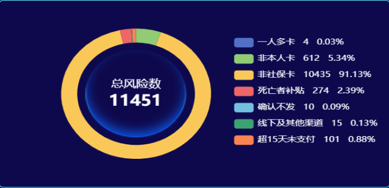

# echarts饼图镶嵌图片

## 前言
最近遇到一个需求是，echarts饼图向左偏一定位置，但是在饼图中间需要镶嵌图片以及接口查出来的一部分数据，在网上搜了一下，发现比较少，在这里记录一下
以下是最终效果图：



---
## 一、echarts进行偏移
首先是对echarts饼图进行向左偏移
```javascript
series: [
	 { 
	 	name: 'Access From',
	    type: 'pie',
	    radius: ['55%', '70%'],
	    avoidLabelOverlap: false,
	    center: ['35%', '50%'],// 通过center属性设置偏移量
	}
]
```
## 二、对echarts中心设置图片和文字展示
### 1.设置背景图片
通过echarts中的graphic属性设置中心的背景图片
```javascript
graphic: {
        elements: [{// 环形图中间背景图
            type: 'image',
            style: {
              image: totalRisk,
              width: 130, 
              height: 130, //设置图片的宽高度
            },
            left: "22%",
            top: "center", // 设置图片在X轴，Y轴的位置，这里就需要自己调试了
          }]
        },
```
### 2.设置中心文字
在series属性中设置对应的文字
```javascript
{
            name: '中间文字',
            z: 100,
            type: 'gauge', // 这个type类型要设置为gauge
            radius: '-50%',
            center: ['35%', '50%'],// 需和type: 'pie'中的center一致
            // 配置中间的数字的样式
            detail: {
              // 调节数字位置
              offsetCenter: [-1,12],
              color: '#fff',
              fontSize:'22px'
            },
            pointer: {
              show: false,
            },
            axisTick: {
              show: false,
            },
            axisLine: {
              show: false,
            },
            splitLine: {
              show: false,
            },
            axisLabel: {
              show: false,
            },
            // 中间的字和数字 数据
            data: [
              {
                value: this.totalRiskCount,
                name:'总风险数',
                title:{// 配置“总风险数”的样式
                  show:true,
                  color: '#fff',
                  offsetCenter:[0,'20%']// 配置“总风险数”的位置
                }
              },

            ],
          },
```
---
## 总结
其实通过graphic也可同时设置中间的文字，也可调节文字的位置，但是如果文字是动态的话，就不会一直居中。
