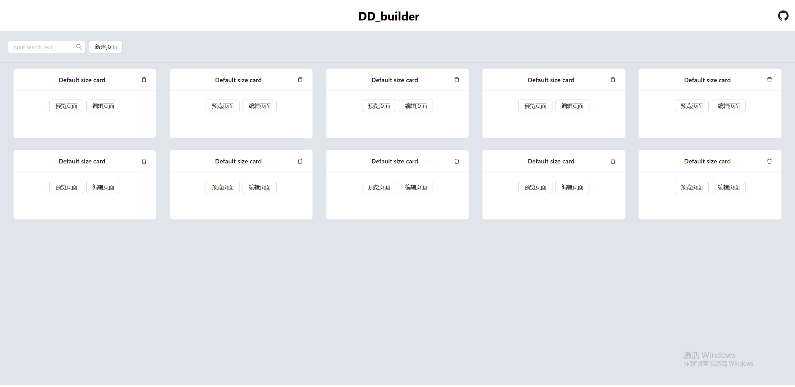

# first-从零搭建一个简易的低代码平台

*轻量级的低代码平台*

------

因为最近在学react，便想通过构建一个简单的项目，来练习一下react。

从零搭建了一下简易版的低代码平台，这个系列将会持续更新，不断地对这个项目进行维护增加功能

主页如下，是可以展示保存后的页面列表的，相应的可以进行预览编辑删除等操作，也可进行新增页面

数据是相应的存储在数据库中，所以也会有一个使用java开发的后端项目配套使用

操作页面如下：左侧维护组件，中间是组件拖拽布局区，右侧可以调整对应组件的属性和样式。

主要使用的技术栈：react+antdesign+alova+react-router

**对应的github仓库地址：**https://github.com/ddddkw/tools_web
