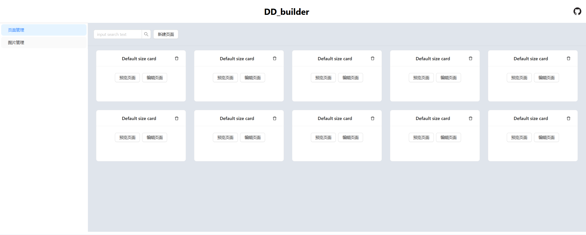
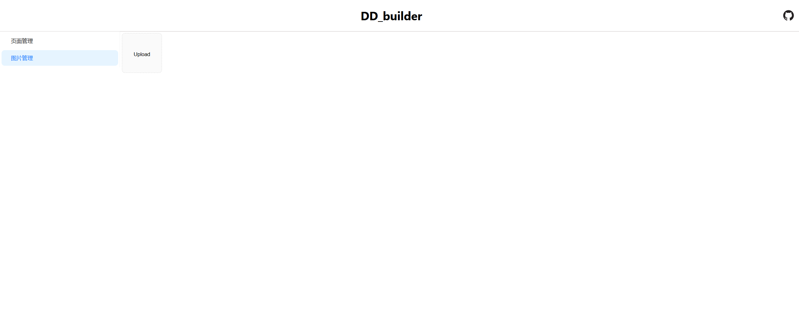

# react-router

记录一下react-router的使用过程。

#### 一，安装react-router-dom

```javascript
npm i react-router-dom
```

#### 二，在项目中引入并使用react-router

在项目中，由于我使用的是嵌套路由，所以主要使用的是<Outlet/>组件，至于其它的组件，大家可查询官网如何使用

- **组件介绍**：Outlet组件是React Router的一部分，它允许开发者在同一页面内展示多层级的UI结构，从而实现嵌套布局。当父路由匹配时，Outlet会根据子路由的配置渲染相应的组件。
- **使用场景**：在开发复杂的单页应用（SPA）时，通常会遇到需要嵌套路由的情况。例如，一个仪表盘（Dashboard）页面可能包含多个子页面，如消息（Messages）、任务（Tasks）等。在这种情况下，可以使用Outlet组件来管理和渲染这些子页面的内容。
- **工作原理**：当应用中的某个路由被匹配时，React Router会根据Routes组件中的配置进行路径解析。如果父路由匹配成功，React Router会查找是否有子路由匹配当前路径。如果找到匹配的子路由，就会通过Outlet渲染对应的组件。
- **高级用法**：Outlet组件还支持使用context属性传递数据，这允许在父组件与子组件之间共享数据，而无需使用全局状态管理或复杂的props传递。此外，Outlet组件还可以结合条件渲染和React Router的动态路由功能，实现复杂的路由管理。

##### 1，创建路由实例

index.tsx

```javascript
import {createBrowserRouter} from "react-router-dom";
import {buildRoutes} from "./buildPage";
import {homeRoutes} from "./homePage";

const router = createBrowserRouter([
    ...buildRoutes,
    ...homeRoutes
])
export default router
```

buildPage/index.tsx

```javascript
import BuildPage from '../../views/index'
const buildRoutes=[
    {
        path:'/BuildPage',
        element:<BuildPage/>
    },
]
export {
    buildRoutes
}
```

homePage/index.tsx

```javascript
import {PageList} from "../../views/homePage/pageList";

const homeRoutes=[
    {
        path:'/HomePage',
        element: <HomePage/>,
        children:[
            {
                path:'PageList',
                element:<PageList/>,
                displayName:'页面管理'
            },
            {
                path:'ImageManage',
                element:<ImageManage/>,
                displayName:'图片管理'
            }
        ]
    },
    {
        path:'/',
        element:<HomePage/>
    }
]
export {
    homeRoutes
}
```

##### 2，具体使用页面

App.js中使用Outlet来渲染第一级的路由

```javascript
import './App.css';
// import Main from './views/index.tsx'
import {Outlet, RouterProvider} from 'react-router-dom';
import router from "./routers";
import React from 'react';
import 'antd/dist/antd';

function App() {
  return (
    <div className="App">
        <RouterProvider router={router}>
            {/* 应用的其他部分，如导航栏、布局组件等 */}
            <Outlet /> {/* Outlet 用于渲染当前匹配的路由组件 */}
        </RouterProvider>
    </div>
  );
}

export default App;

```

homePage.tsx-homePage下的二级路由在一级路由页面下使用<Outlet/>进行渲染

```javascript
import Header from "../components/Header";
// import Main from "./components/index";
import {SubLayout} from "./components/subLayout";
import './index.css'
import {Outlet} from "react-router-dom";
export function HomePage(){
    return(
        <div>
            <Header homePage={true}></Header>
            <div className={'homeBody'}>
                <SubLayout></SubLayout>
                <Outlet></Outlet>
                {/*<Main></Main>*/}
            </div>
        </div>
    )
}
```

具体效果如下：




